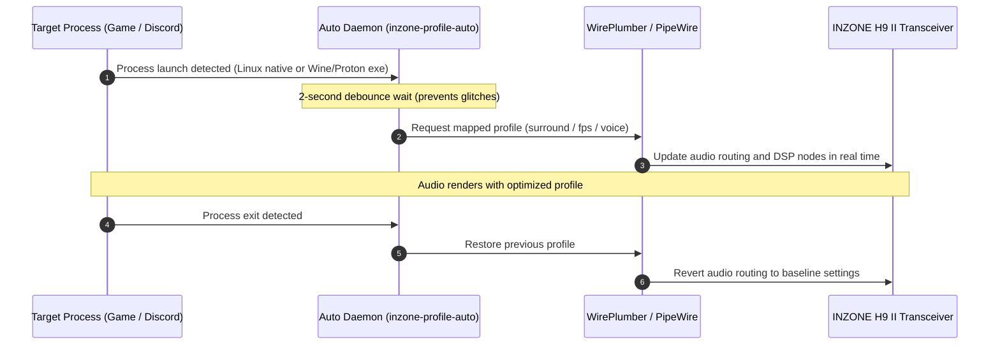
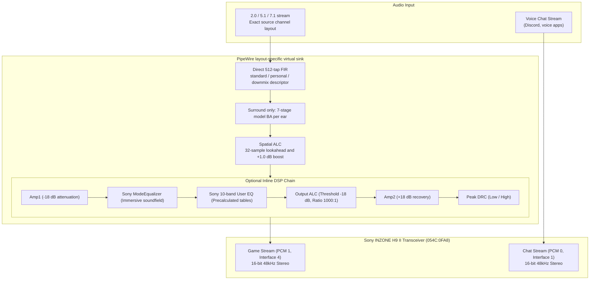

# Sony INZONE H9 II for Linux

[](LICENSE)
[](https://www.swift.org)
[](https://pipewire.org)

A native Linux control and DSP audio stack for the **Sony INZONE H9 II (MDR-G900N / Model Code YY2987)** wireless gaming headset.

Reverse-engineered from the Windows-only **INZONE Hub** utility, this project implements layout-preserving 2.0, 5.1, and 7.1 audio rendering, Sony proprietary 10-band EQ and presets, USB HID hardware control, dynamic sound profiles, and automated profile switching using **PipeWire**, **WirePlumber**, and an **Embedded Swift native LADSPA engine**.

Sony account and cloud functions are outside the project scope. Firmware support is deliberately limited to reading the versions installed on the headset and transceiver. The project does not look up, download, update, or flash firmware.

---

## Key Features

- **Sony Spatial Audio and Surround-Off Downmix**
  - Direct 512-tap FIR rendering from Sony HRTF assets, followed by the H9 II-dedicated 7-stage IIR Biquad hardware correction filter (`wh_g910n_standard.ba`) when surround is enabled.
  - Stereo, 5.1, and 7.1 virtual sinks preserve the source layout. Surround-off profiles use Sony `downmix.hki` instead of bypassing the Sony downmix path.
  - Integrated 32-sample lookahead internal spatial ALC (dynamic limiter) to prevent clipping and balance volume.
- **H9 II Status and Hardware Control (USB HID)**
  - Direct control over headphone hardware volume, headset microphone mute, Active Noise Cancellation, 20-step Ambient Sound level, Voice Focus, Sidetone, and Game/Chat hardware balance.
  - Configurable physical button cycles, power-on defaults, auto-power-off timer, and voice guidance. Status includes battery, installed firmware, headphone, microphone, Bluetooth, and microphone-attachment state.
  - Unsolicited HCI notifications update the TUI after a snapshot without allowing stale notifications to overwrite newer state.
- **Sony Official 10-Band EQ & 7 Presets**
  - Built-in Flat, FPS 1/2/3, Immersion Flat (RPG), Bass Boost, and Music/Video presets utilizing Sony precision-tuned Biquad coefficient tables.
  - Fully customizable 10-band user EQ (-12 dB to +12 dB in 1 dB steps).
- **Dynamic Profiles and Automatic App Switching**
  - Create, clone, rename, delete, import, and export custom profiles while retaining stable UUID identifiers and their routing templates.
  - Automatically switches to surround/FPS profiles when games launch (supporting native Linux, Steam, Proton, and Wine binaries) and switches to voice mode when Discord launches, restoring the previous profile when exited.
- **Intuitive TUI & Powerful CLI**
  - Interactive terminal interface (`inzone-profile`) driven by SwiftTUI with mouse and keyboard controls, plus a comprehensive CLI for scripting, hotkeys, and window manager integration.
- **Windows Profile & Personalized HRTF Interoperability**
  - Import and export individual entries or complete Windows-compatible `SoundProfile.json` collections. The Linux collection path preserves known fields, ordering, identifiers, routing templates, and retained extension fields subject to validation limits.
  - Import mobile ear-measurement personalization files (`personalized_hrtf.hki`, `YY2987.ba`) through an atomic activate-or-rollback lifecycle.

---

## System Requirements

- **OS**: Linux (PipeWire and WirePlumber desktop environment)
- **Target Device**: Sony INZONE H9 II USB Wireless Transceiver (USB VID `054C`, PID `0FA8`)
- **Required Runtime Packages**:
  - `pipewire-bin` (`pw-dump`, `pw-cat`, `pw-cli`, etc.)
  - `pulseaudio-utils` (`pactl` for volume control)
  - `systemd` user service support
- **Build Tools**:
  - Swift 6.3 or higher ([Official Swift Installation Guide](https://www.swift.org/install/linux/))
  - `build-essential` (`make`, C compiler, and linker)
  - `ladspa-sdk` (LADSPA C headers)
  - `7zip` (`7z` or `7zz`)
  - `.NET 10 SDK` (for running ILSpy during asset extraction from official installer)

> **Note**: Neither the Swift toolchain nor .NET is required for daily operation after installation. CLI binaries are statically linked against the Swift standard library, and the DSP plugin is compiled using Embedded Swift for minimal, standalone execution.

---

## Quick Start

In compliance with Sony proprietary licensing, no binary assets are bundled in this repository. A single `make` invocation downloads the official installer, verifies its integrity, extracts filter assets, builds the binaries, and installs the driver stack.

### 1. Install Dependencies
Debian / Ubuntu:
```sh
sudo apt update
sudo apt install pipewire-bin pulseaudio-utils 7zip build-essential ladspa-sdk
```

### 2. Build and Install
**Run as a regular user (not root)**:
```sh
# Fetch dependencies, build, and install the complete stack
make
```

> **Privilege Note**: Do not run `sudo make`. User-space files (`~/.local/bin`, `~/.config`) are installed under regular user permissions. `sudo` is requested only at the final step for installing udev rules (`/etc/udev/rules.d`) and system LADSPA plugins (`/usr/lib/ladspa`).

Run installation in a foreground terminal. During administrator authentication,
the installer hands terminal control to `sudo`, which reads the password directly.
Password characters are not echoed. Terminal ownership and input settings are
restored when the command finishes, fails, is interrupted, or times out.

### 3. Reconnect Device & Activate
Unplug and replug the USB dongle to apply the new udev permissions, then activate the surround sound profile:

```sh
inzone-profile surround
```

The Sony spatial audio stack is now active.

---

## Interactive TUI Guide

See [DESIGN.md](DESIGN.md) for the visual system, interaction contracts, and design-review requirements.

Running `inzone-profile` without arguments opens the interactive terminal controller:

```sh
inzone-profile
```
*(Recommended terminal size: 72 columns × 24 rows or larger)*

The profile list displays names without ordinal numbers or active-state labels.
Bold text and a neutral highlight identify the selected profile.
The details area describes the selected profile. Selecting a row does not apply it;
use **Apply** or **Enter** to activate the selection.
The selected profile's description and sound-processing values appear in a separate
detail column. Unavailable settings show `—`.

Open **Manage profiles** or press **G** to create, duplicate, rename, or delete
custom profiles and to import, replace, or export Windows collections. Custom
profiles keep stable UUIDs, and the list pages through the five built-ins, up to
256 custom profiles, and Restore. The TUI requests a literal confirmation token
before deletion, explicit collection replacement, file overwrite, personalization reset,
or replacement of an installed personal bank.

### Touch Layout

The default layout places a profile list beside its details. Primary action buttons
use three-row targets; profile rows use two rows in short windows and three rows
when at least 30 terminal rows are available. Tap **Controls** for DSP values, EQ,
and presets. The bottom action area opens **Device** and **Automation** directly.
**Device & apps** also provides these destinations and personalization imports.
Tap **Compact** for the dense desktop layout, or **Touch layout** to return.
The layout choice lasts for the current session.

Both layouts share a fixed three-row header and two-row footer. The header shows
the current screen and the layout toggle. The footer displays the operation status
or device error on its first row and screen-specific shortcuts on its second row.
Content and the workspace sidebar occupy the area between them, so navigation,
editing, and resizing do not move the header or footer into the content area.
A blank row separates the content from both the header and footer.

The interface uses neutral graphite surfaces, blue primary actions, and restrained
secondary text. Hover and press feedback cover the full target. Releasing outside
a button cancels its action. Selection uses weight and neutral shading; destructive
actions use red labels. Button labels have no decorative brackets or selection
prefixes. DSP controls show their current
values and are disabled when the selected profile does not support them.

At 110 columns or wider, the touch layout adds a workspace sidebar with direct
navigation to Profiles, Device, and Automation. Profile details remain in the main
content area instead of repeating in the sidebar.
Navigation is disabled while an editor is open or an operation is running;
save or cancel the editor before changing sections. Smaller windows retain the
single-panel layout, including the 72×24 minimum.

The touch EQ screen shows all ten band gains as bars around a 0 dB baseline.
Tap a bar or frequency to select a band, then drag vertically to adjust its draft
gain within −12 to +12 dB. Dragging stays on the original band and clamps at the
plot limits. Frequency-label taps and drags select without changing gain.
Use **− 1 dB** / **+ 1 dB** for precise changes and **‹** / **›** to switch bands.
The graph's drag resolution depends on terminal height. It displays band settings,
not the calculated filter frequency response. **Reset all** resets the draft for
all ten bands. Only **Save & Apply** saves it; **Cancel** discards it.
Preset and automation lists follow the selection across pages. Device settings use
category tabs with **Previous** and **More settings** for longer sections.

Touch operation requires a terminal or remote terminal client that translates
touch taps into primary-pointer press and release reports. Target sizes use terminal
cells, not physical pixels; adjust the terminal font size for the display.
Native multitouch gestures are not used. Text entry requires a physical or system
onscreen keyboard; the TUI does not provide a virtual keyboard.

The layout adapts the [HIG layout](https://sosumi.ai/design/human-interface-guidelines/layout),
[color](https://sosumi.ai/design/human-interface-guidelines/color), and
[button](https://sosumi.ai/design/human-interface-guidelines/buttons) principles to
terminal cells. It does not implement native Apple materials or physical point sizing.
It also applies [One UI's viewing and interaction areas](https://developer.samsung.com/one-ui/index.html),
[grouped settings lists](https://developer.samsung.com/one-ui/comp/list.html), and
[concise, task-focused wording](https://developer.samsung.com/one-ui/writing/simple-and-human.html).
Status information stays above the settings, and Apply/Discard stay at the bottom.

### Visual Review

Export hardware-independent screen previews and render their actual ANSI colors:

```sh
INZONE_TUI_PREVIEW_DIRECTORY=/tmp/inzone-preview swift test --filter VisualPreviewTests
python3 tools/render_tui_snapshot.py /tmp/inzone-preview /tmp/inzone-preview-png
```

The optional PNG renderer requires Pillow and DejaVu Sans Mono fonts. Neither is a
runtime dependency. Preview data is synthetic and does not read device settings.

### Mouse Controls

Mouse operation requires a terminal that forwards SGR mouse reports. SwiftTUI 0.12.0
enables reporting for the interactive session and restores it on normal exit.
The interface uses the framework's [pointer and gesture APIs](https://minacle.github.io/swift-tui/latest/documentation/swifttuiessentials/inputrecognition/).
Keyboard shortcuts remain available when mouse reports are unavailable.

| Target | Mouse action | Result |
|:---|:---|:---|
| Profile, preset, device, or automation row | Click | Select the row without applying or deleting it |
| Lists and EQ | Wheel up/down | Move the selection as with the arrow keys; long lists follow the selection |
| Button | Click | Run the displayed action, including navigation, Apply, Back, and Cancel |
| EQ band | Click **−** or **+** | Select the band and adjust its draft gain by 1 dB, within −12 to +12 dB |
| EQ graph | Tap to select; drag vertically to adjust | Edit the original band's draft gain without applying it |
| EQ footer | Click **Reset**, **Save & Apply**, or **Cancel** | Reset the draft to zero, save it, or discard it |
| Device setting | Click **−** / **+**, or tap an On/Off value | Stage a value marked `*`; changing rows or tabs preserves it |
| Device action area | Click **Apply** or **Discard** | Apply all available drafts or clear them without writing to the device |
| Input form | Click the field, **Continue** / **Save**, or **Cancel** | Edit text, advance or complete the form, or return to the previous screen |

The compact EQ meter shows the draft gain and its zero reference. Profile DSP controls
(DRC, Output ALC, Mic AGC, and HRTF) apply immediately, as their keyboard shortcuts do.
Selection and setting changes are blocked while an operation is in progress.

### Keyboard Shortcuts

| Shortcut | Action | Description |
|:---:|:---|:---|
| **↑ / ↓** | Move cursor | Browse built-in and custom profiles; long lists follow the selection |
| **Enter** | Apply profile | Immediately commit selected profile and DSP graph to WirePlumber |
| **G** | Manage profiles | Create, duplicate, rename, delete, import, replace, or export sound profiles |
| **H** | Device controls | Open noise, sound, microphone, and system settings |
| **E** | Edit 10-band EQ | Adjust bands from 31.5 Hz to 16 kHz (-12 to +12 dB) |
| **S** | Select Sony preset | Choose from Flat, FPS 1/2/3, RPG, Bass Boost, or Music/Video |
| **D** | Dynamic Range Control (DRC) | Cycle through Off → Low → High |
| **A** | Output Auto Level Control | Toggle profile-specific Output ALC |
| **M** | Mic Auto Gain Control | Toggle profile-specific Microphone AGC |
| **P** | HRTF mode | Select Standard or Personal HRTF in surround mode |
| **I** | Import personalization | Input file paths for mobile HKI and correction BA files |
| **U** | Process auto-switching | Edit executable binding rules and toggle background daemon |
| **Q / Esc** | Quit | Exit TUI (current audio settings remain active) |

### Device Controls (H Key)

The touch layout keeps connection and battery status in a compact top area.
Battery status includes the reported percentage, a ten-segment gauge, and charging
state. Low charge (20% or below) and charge errors use the warning color.
Missing or invalid battery readings remain unavailable rather than appearing as 0%.
Disconnected snapshots do not retain stale battery or firmware values.

Settings are grouped into Noise, Sound, Mic, System, and Info tabs. Each setting
has its own value control: tap binary values to toggle them or use the adjacent
minus/plus buttons. Firmware versions appear in Info. Mic contains the microphone
monitor control. Setting labels align left and values align right.

Tap a tab or swipe left/right across the tabs or settings area to change sections.
Each swipe moves one section and stops at either end. Swiping across a control does
not change its value. Tabs and setting rows are three rows high with centered text.

Draft changes survive row selection, tab changes, refresh, and workspace navigation.
Apply writes and verifies each setting sequentially. Confirmed readbacks clear the
corresponding drafts; unconfirmed drafts remain after a failure. If a draft's setting
is unavailable, refresh the connection or discard the drafts before applying.
Drafts are held only for the current TUI session.

Headset HCI events update asynchronously. Game, Chat, and microphone levels owned
by PipeWire/PulseAudio are read with the snapshot and have no HCI notification;
press **R** after changing those values in another mixer.

- **← / → Arrow Keys**: Adjust selected hardware parameter (e.g., cycle ANC modes, change Sidetone level)
- **Enter**: Apply the staged device and system-audio settings
- **R**: Refresh live headset state (battery level, firmware version, etc.)
- **T**: Microphone loopback audio test (up to 30 seconds, pure in-memory playback without file writes)

---

## CLI Command Reference

The command-line interface enables scripting, desktop shortcuts, and window manager integration (i3, sway, Hyprland).

### 1. Profile Management
```sh
# Switch profile immediately
inzone-profile surround      # 7.1ch surround mode
inzone-profile fps           # Footstep-boosted FPS mode
inzone-profile music         # Music listening mode

# Check current status and list built-in and custom profiles
inzone-profile --status
inzone-profile --profiles

# Create from a built-in or custom base, then manage by stable UUID
inzone-profile --profile-create "Tournament" fps
inzone-profile --profile-clone PROFILE_UUID "Tournament copy"
inzone-profile --profile-rename PROFILE_UUID "Tournament final"
inzone-profile --profile-delete PROFILE_UUID
```

Custom profiles inherit one of the five routing templates (`fps`, `music`,
`voice`, `balanced`, or `surround`) and retain that template when renamed or
round-tripped through the Linux collection path. Up to 256 custom profiles are
stored in `~/.config/inzone-h9-ii/sound-profiles.json`, with a 24 MiB encoded
collection limit that accounts for retained Windows objects. A profile cannot be
deleted while it is active or referenced by an automation rule or pending
restoration state.

### 2. Hardware Device Control (`--device-set`, `--device-status`)
```sh
# Query live headset status (battery, firmware, ANC state in JSON)
inzone-profile --device-status

# Change noise control mode (0: Off, 1: Noise Canceling, 2: Ambient Sound)
inzone-profile --device-set anc 1

# Set sidetone (mic monitoring) level (0 to 10)
inzone-profile --device-set sidetone 4

# Enter Ambient mode, then adjust its sound level (1 to 20)
inzone-profile --device-set anc 2
inzone-profile --device-set ambient_level 12

# Adjust Game / Chat hardware balance (0 to 100 in steps of 10, 50 is center)
inzone-profile --device-set game_chat 50
```

> **Supported hardware fields**: `headphone_volume`, `anc`, `ambient_level`, `voice_focus`, `game_chat`, `sidetone`, `toggle_off`, `toggle_nc`, `toggle_ambient`, `nc_startup`, `bt_startup`, `auto_power`, `language`, `guidance`

The H9 II reports headphone and boom-microphone mute state through Events 33
and 36. Hub 1.0.19.0 changes only the Event 33 volume value for this model and
exposes the generic Event 36 SET button only for INZONE Buds. `--device-status`
therefore reports both mute states without offering unsupported hardware SETs.

`--device-status` sends read-only GET requests, including Event 3 for the
firmware versions installed on the headset and transceiver. It does not query a
release service or compare those values with a latest version. Event 160 and
all firmware lookup, download, update, and flashing paths are intentionally
unsupported.

### 3. DSP and EQ Parameter Control
```sh
# Apply Sony official presets
inzone-profile --preset fps fps1
inzone-profile --preset surround immersion_flat

# Configure Dynamic Range Control (0: Off, 1: Low, 2: High)
inzone-profile --set fps drc 2

# Set custom 10-band EQ values (-12 to +12 dB)
inzone-profile --set music eq '[0, 0, 1, 2, 0, 0, -1, 1, 2, 3]'

# Enable microphone auto gain control
inzone-profile --set voice mic_agc true

# Export and import profile settings
inzone-profile --export my_settings.json
inzone-profile --import my_settings.json
```

---

## Automated Profile Switching by Process Detection

Configure a background service to automatically activate surround mode when launching a game and voice mode when launching Discord:

```sh
# Bind executable names to profiles (last argument is priority; higher wins)
inzone-profile --auto-bind cs2 fps 15
inzone-profile --auto-bind game.exe surround 10
inzone-profile --auto-bind discord voice 5

# View registered auto-switch rules
inzone-profile --auto-config

# Enable background service (registers and starts systemd user daemon)
inzone-profile --auto-enable

# Disable service
inzone-profile --auto-disable

# Remove a specific rule
inzone-profile --auto-remove game.exe
```

- **Full Wine / Proton Support**: Accurately detects Windows process names (`*.exe`) running under Steam Proton or Wine in addition to native Linux executables.
- **Audio Debounce**: Requires a 2-second continuous state match before switching, preventing transient audio interruptions during brief process spawns.
- **Smart Restoration & Manual Priority**: Automatically restores the previous profile upon game exit. If the user manually changes profiles while a game is running, the manual selection takes precedence and is retained.



---

## Windows Profiles & Personalized HRTF Integration

### 1. Import Mobile App Personalized HRTF
Personalized spatial audio generated via ear photography in the Sony mobile app can be imported into Linux:
- **Windows Path**: `%APPDATA%\Sony\INZONE Hub\VirtualizeUser`
- **Required Files**: `personalized_hrtf.hki` and model correction file `YY2987.ba`

```sh
# Import personalized files (automatic Cipher 7 decryption & validation)
inzone-profile --personalize-import /path/to/personalized_hrtf.hki /path/to/YY2987.ba

# Enable personalized HRTF in surround profile
inzone-profile --set surround hrtf '"personal"'

# Reset profiles to the standard HRTF and inspect or retry retired-bank cleanup
inzone-profile --personalize-reset
inzone-profile --personalize-cleanup-status
inzone-profile --personalize-cleanup
```

Import decrypts and validates both files into a private staged bank, atomically
exchanges the complete bank, and activates the current profile. An activation
failure triggers restoration of the previous bank and profile state. If the
asset swap-back itself cannot complete, the unresolved old bank remains protected
from cleanup and the combined failure is reported. Replaced banks are retired
until no FIR loader can still hold them; a committed import or reset may therefore
report cleanup as pending without reverting the committed audio state.

### 2. Windows INZONE Hub Profile (`SoundProfile.json`)
Directly import or export profiles configured in Windows INZONE Hub (`%APPDATA%\Sony\INZONE Hub\SoundProfile.json`):

```sh
# List profiles in Windows file
inzone-profile --windows-list /path/to/SoundProfile.json

# Import a specific profile to Linux
inzone-profile --windows-import surround /path/to/SoundProfile.json 1

# Export one Linux profile to a Windows-compatible JSON file
inzone-profile --windows-export surround exported_profile.json

# Import or export a complete Windows-compatible collection through the CLI
inzone-profile --windows-import-collection /path/to/SoundProfile.json
inzone-profile --windows-export-collection exported_collection.json
```

The TUI **Import** action appends without confirmation and reports imported and
skipped counts when the 256-profile limit is reached. **Replace** requires the
`IMPORT` token, publishes the complete collection atomically, and rejects active
or automation-referenced profiles that would disappear. Existing Windows objects are retained so
unknown extension fields can survive a Linux import/export cycle. Import still validates known
enums, EQ values, profile count, identifiers, names, and file-size limits; it is
not an unrestricted byte-for-byte identity operation. Windows collection files
are limited to 16 MiB and 256 entries. Linux-only options that cannot be represented
without loss cause export to fail instead of being silently dropped.

Acceptance by INZONE Hub and preservation of the Linux routing-template extension
after Hub loads and saves the file remain `Verification required`. When a unique
`ProfileID` matches the collection already installed on the same machine, import
can recover a stripped routing template from that existing record. A cross-machine
file without the extension falls back to `surround` or `balanced` from its
Surround flag.

---

## Audio Architecture & DSP Pipeline

The INZONE H9 II wireless USB transceiver exposes two independent physical PCM playback streams:
- **Game Stream (PCM 1)**: `alsa_output.usb-Sony_INZONE_H9_II-00.stereo-game` (games and primary audio)
- **Chat Stream (PCM 0)**: `alsa_output.usb-Sony_INZONE_H9_II-00.stereo-chat` (Discord and voice communications)

The driver creates layout-specific virtual sinks and renders stereo to the Game
stream. Applications should select the sink matching the stream they produce.
Each graph declares that exact layout and sets `stream.dont-remix=true` and
`channelmix.upmix=false`; normal desktop-session negotiation still requires
environment-specific verification.

| Input layout | Surround enabled | Surround off |
|---|---|---|
| 2.0 (`FL FR`) | `inzone.sony-surround.stereo` | `inzone.sony-downmix` |
| 5.1 (`FL FR FC LFE SL SR`) | `inzone.sony-surround.5.1` | `inzone.sony-downmix.5.1` |
| 7.1 (`FL FR FC LFE RL RR SL SR`) | `inzone.sony-surround` | `inzone.sony-downmix.7.1` |

The default for a surround-template profile is the 7.1 surround sink. The
default for other Game-template profiles is the stereo downmix sink. Voice uses
the physical Chat stream, and Restore returns to the physical Game stream.



> **In-Game Audio Configuration**:
> If a game provides its own headphone spatializer or 3D audio engine, running both can cause phase cancellation and muffled sound. Disable that spatializer and select the virtual sink whose 2.0, 5.1, or 7.1 layout matches the game's speaker output.

---

## Development & Build Targets

Contributors must follow [AGENTS.md](AGENTS.md). Run project build, test,
diagnostic, and device commands only in a normal unsandboxed environment; use a
sandbox only for file editing. The project policy also fixes the firmware boundary
at installed-version GET support and forbids updater implementation or execution.

Common `make` targets for repository maintenance:

```sh
# 1. Synchronize Swift dependencies
make sync

# 2. Download official installer and verify SHA-256
make fetch

# 3. Extract assets statically and decompile
make assets

# 4. Build all targets (CLI/TUI + Embedded Swift LADSPA DSP)
make build

# 5. Run test suite and DSP numerical verification
make check

# 6. Display Make targets and options
make help
```

---

## Technical Documentation

Detailed reverse-engineering specifications and internal implementation architectures are available in `docs/`:

- [Feature Specification & Implementation Status (docs/features.md)](docs/features.md): Feature matrix, scope, and Hub parity
- [Reverse Engineering Technical Specification (docs/reverse-engineering.md)](docs/reverse-engineering.md): Binary disassembly, key derivation algorithms, and USB HID protocol
- [Repository Structure & Asset Lifecycle (docs/repository-files.md)](docs/repository-files.md): Clean-room asset policies, build lifecycle, and directory layout
- [Implementation & Verification Audit (docs/completion-audit.md)](docs/completion-audit.md): Numerical precision verification and diagnostic test results
- [Analysis Reports and Verification Archive (analysis/README.md)](analysis/README.md): Measurement summaries and JSON reports

---

## License

Distributed under the [MIT License](LICENSE). Sony and INZONE are trademarks or registered trademarks of Sony Group Corporation. This project is an independent community open-source effort and is not affiliated with or endorsed by Sony.
