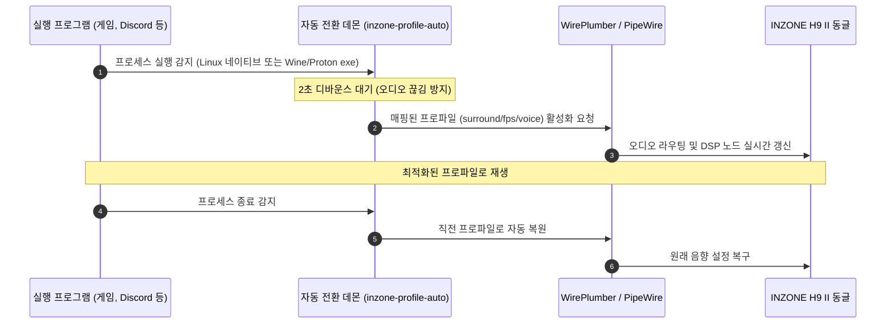
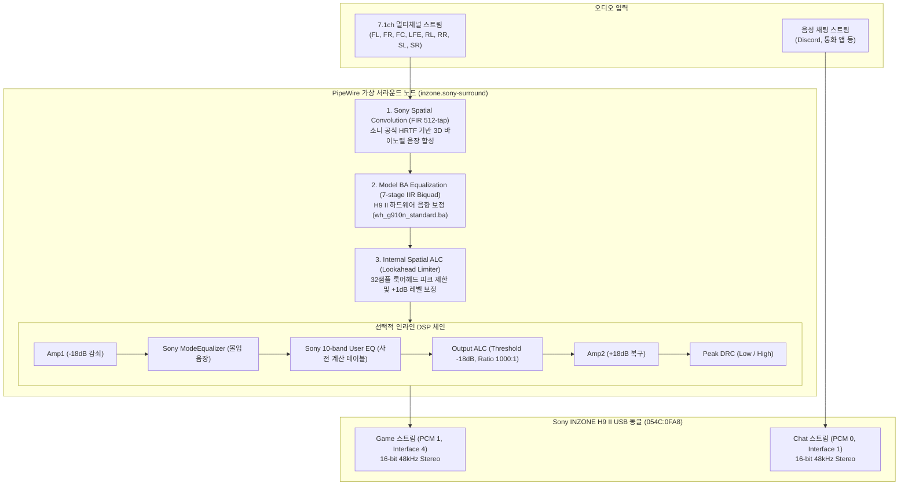

# Sony INZONE H9 II for Linux

[](LICENSE)
[](https://www.swift.org)
[](https://pipewire.org)

Sony의 무선 게이밍 헤드셋 **INZONE H9 II (MDR-G900N / 모델 코드 YY2987)**를 Linux 환경에서 완벽하게 사용할 수 있도록 만든 네이티브 드라이버 및 DSP 오디오 스택입니다.

Windows 전용 프로그램인 **INZONE Hub**를 리버스 엔지니어링하여, 7.1ch 공간 음향(Spatial Audio), 소니 전용 10밴드 EQ 및 프리셋, 노이즈 캔슬링/주변 소리/사이드톤 등 USB HID 하드웨어 제어, 그리고 프로세스 감지 자동 프로파일 전환 기능을 **PipeWire**, **WirePlumber**, 그리고 **Embedded Swift 네이티브 LADSPA 엔진**으로 완벽하게 구현했습니다.

이제 Linux에서도 Windows 유틸리티 없이 헤드셋의 모든 기능을 온전히 활용할 수 있습니다.

---

## 주요 기능

- **소니 정품 7.1ch 공간 음향 (Spatial Audio)**
  - 소니 공식 512-tap FIR HRTF 필터와 H9 II 전용 7단 IIR Biquad 하드웨어 보정 필터(`wh_g910n_standard.ba`)를 실시간 구동합니다.
  - 피크 왜곡을 방지하고 음량을 보정하는 32-샘플 룩어헤드 내부 공간 ALC(Dynamic Limiter)가 내장되어 있습니다.
- **하드웨어 완벽 제어 (USB HID)**
  - 액티브 노이즈 캔슬링(ANC) 끄기/켜기, 주변 소리 20단계 조절, 음성 집중 모드, 사이드톤(내 목소리 듣기), Game/Chat 하드웨어 음량 밸런스를 즉시 제어합니다.
  - 본체 물리 버튼의 순환 모드 설정, 전원 켤 때 기본 상태, 자동 절전 타이머, 음성 안내 언어 설정 및 실시간 배터리 잔량 조회를 지원합니다.
- **소니 공식 10밴드 EQ 및 7대 프리셋**
  - 소니가 정밀 튜닝한 Biquad 계수 테이블을 그대로 적용하여 Flat, FPS 1/2/3, Immersion Flat(RPG), Bass Boost, Music/Video 프리셋을 기본 제공합니다.
  - 사용자 맞춤 10밴드 커스텀 EQ(-12dB ~ +12dB, 1dB 단위)도 자유롭게 설정할 수 있습니다.
- **게임 및 앱 자동 프로파일 전환**
  - 게임(Steam, Proton, Wine 실행 파일 포함)을 켜면 서라운드/FPS 프로파일로, 디스코드를 켜면 통화 모드로 자동 전환되며, 게임이 종료되면 원래 프로파일로 복원됩니다.
- **직관적인 TUI 및 강력한 CLI**
  - 터미널에서 방향키로 모든 설정을 조작할 수 있는 SwiftTUI 인터페이스(`inzone-profile`)와 스크립트/단축키 연동을 위한 완전한 CLI를 제공합니다.
- **Windows 프로파일 및 개인화(HRTF) 연동**
  - Windows INZONE Hub에서 내보낸 `SoundProfile.json`을 가져오거나 내보낼 수 있습니다.
  - 모바일 앱에서 귀 사진을 촬영하여 생성된 개인화 파일(`personalized_hrtf.hki`, `YY2987.ba`)을 Linux로 가져와 나만의 맞춤 공간 음향을 적용할 수 있습니다.

---

## 시스템 요구사항

- **OS**: Linux (PipeWire 및 WirePlumber 기반 데스크톱 환경)
- **대상 기기**: Sony INZONE H9 II USB 무선 동글 (USB VID `054C`, PID `0FA8`)
- **필수 런타임 패키지**:
  - `pipewire-bin` (`pw-dump`, `pw-cat`, `pw-cli` 등)
  - `pulseaudio-utils` (`pactl` 볼륨 제어용)
  - `systemd` 사용자 서비스 지원
- **빌드 도구**:
  - Swift 6.3 이상 ([Swift 공식 설치 가이드](https://www.swift.org/install/linux/))
  - `build-essential` (`make`, C 컴파일러 및 링커)
  - `ladspa-sdk` (LADSPA 헤더)
  - `7zip` (`7z` 또는 `7zz`)
  - `.NET 10 SDK` (소니 공식 인스톨러에서 에셋 추출 시 ILSpy 구동용)

> **참고**: 빌드 및 설치 후 일상적인 실행에는 Swift 도구체인이나 .NET이 필요하지 않습니다. CLI 바이너리에는 Swift 표준 라이브러리가 정적 링크되어 있고, 오디오 DSP 플러그인은 Embedded Swift로 빌드되어 가볍게 독립 실행됩니다.

---

## 빠른 시작

Sony 공식 라이선스를 존중하여 저장소에는 독점 바이너리를 포함하지 않습니다. 대신 `make` 명령어 하나로 공식 인스톨러 다운로드, 무결성 검증, 필터 추출, 바이너리 빌드 및 설치가 원스톱으로 진행됩니다.

### 1. 필수 패키지 설치
Debian / Ubuntu 계열:
```sh
sudo apt update
sudo apt install pipewire-bin pulseaudio-utils 7zip build-essential ladspa-sdk
```

### 2. 빌드 및 설치
**반드시 일반 사용자 권한(root가 아닌 일반 데스크톱 계정)**으로 실행하세요:
```sh
# 패키지 의존성 다운로드 및 전체 빌드 & 설치
make
```

> **권한 관련 안내**: `sudo make`로 전체를 실행하지 마세요. 사용자 경로(`~/.local/bin`, `~/.config`) 설치는 일반 권한으로 처리되며, 마지막 단계인 udev 규칙(`/etc/udev/rules.d`) 및 시스템 LADSPA 경로(`/usr/lib/ladspa`) 등록 시에만 필요한 최소한의 작업에 대해 `sudo` 암호를 요청합니다.

### 3. 장치 재연결 및 활성화
설치가 끝나면 USB 동글을 PC에서 한 번 뺐다가 다시 꽂아 udev 권한을 새로 적용합니다. 그런 다음 아래 명령으로 서라운드 프로파일을 활성화해보세요:

```sh
inzone-profile surround
```

축하합니다! 이제 소니 공간 음향 스택이 활성화되었습니다.

---

## 대화형 TUI 가이드

터미널에서 아무 옵션 없이 실행하면 직관적인 대화형 제어창이 열립니다:

```sh
inzone-profile
```
*(터미널 크기: 72열 × 24행 이상 권장)*

```
┌──────────────────────── INZONE H9 II Controller ────────────────────────┐
│  1. fps        FPS · 저음 감소 / 발소리 대역 강조                          │
│  2. music      음악 · 원음 / 안정성 우선                                  │
│  3. voice      통화 · 말소리 강조 / 마이크 저역 정리                      │
│  4. balanced   기본 · EQ 없음 / 균형 설정                                 │
│* 5. surround   서라운드 · Sony 기본 HRTF / 공간 음향                       │
│  6. restore    변경 전 음색·지연 설정 복원                                │
└─────────────────────────────────────────────────────────────────────────┘
```

### 주요 단축키
| 단축키 | 기능 | 설명 |
|:---:|:---|:---|
| **↑ / ↓** 또는 **1~6** | 프로파일 커서 이동 | 원하는 프로파일을 탐색합니다. |
| **Enter** | 프로파일 즉시 적용 | 선택한 프로파일과 DSP를 WirePlumber에 즉시 반영합니다. |
| **H** | 헤드셋 장치 제어 모달 | 노이즈 캔슬링(ANC), 사이드톤, Game/Chat 밸런스 등 하드웨어 설정 창 |
| **E** | 10밴드 EQ 편집 | 31.5Hz ~ 16kHz (-12 ~ +12 dB) 각 밴드 조정 |
| **S** | 소니 공식 프리셋 선택 | Flat, FPS 1/2/3, RPG, Bass Boost, Music/Video 선택 |
| **D** | 동적 범위 제어 (DRC) | 끔(Off) → 낮음(Low) → 높음(High) 순환 변경 |
| **A** | 출력 자동 음량 제어 | 프로파일별 출력 ALC 켜기/끄기 토글 |
| **M** | 마이크 자동 게인 (AGC) | 프로파일별 마이크 자동 게인 제어 토글 |
| **P** | HRTF 모드 선택 | 서라운드 모드에서 기본(Standard) / 개인화(Personal) 선택 |
| **I** | 개인화 파일 임포트 | 모바일 앱의 개인화 HKI 및 보정 BA 파일 경로를 입력받아 적용 |
| **U** | 프로세스 자동 전환 | 실행 파일별 프로파일 바인딩 규칙 편집 및 데몬 켜기/끄기 |
| **Q / Esc** | 프로그램 종료 | TUI를 종료합니다 (현재 적용된 오디오 설정은 그대로 유지됨). |

### 하드웨어 제어 모달 (H 키)
- **← / → 방향키**: 선택한 하드웨어 파라미터 값 변경 (예: ANC 모드 변경, 사이드톤 레벨 조절)
- **Enter**: 변경된 하드웨어 값을 헤드셋으로 즉시 전송
- **R**: 헤드셋의 실시간 상태(배터리 잔량, 펌웨어 버전 등) 다시 읽기
- **T**: 마이크 실시간 테스트 듣기 (최대 30초, 파일 저장 없이 메모리 루프백으로 재생)

---

## CLI 명령어 레퍼런스

스크립트, 데스크톱 단축키, 창 관리자(i3/sway/hyprland) 연동을 위한 강력한 명령줄 인터페이스를 제공합니다.

### 1. 프로파일 관리
```sh
# 프로파일 즉시 전환
inzone-profile surround      # 7.1ch 서라운드 모드
inzone-profile fps           # 발소리 강조 FPS 모드
inzone-profile music         # 음악 감상 모드

# 현재 상태 및 목록 확인
inzone-profile --status
inzone-profile --list
```

### 2. 하드웨어 장치 제어 (`--device-set`, `--device-status`)
```sh
# 헤드셋 실시간 상태 조회 (배터리, 펌웨어, ANC 상태 등 JSON 출력)
inzone-profile --device-status

# 노이즈 캔슬링(ANC) 모드 변경 (0: 끔, 1: 노이즈 캔슬링, 2: 주변 소리)
inzone-profile --device-set anc 1

# 사이드톤(내 목소리 듣기) 레벨 조절 (0 ~ 10)
inzone-profile --device-set sidetone 4

# 주변 소리 크기 조절 (1 ~ 20)
inzone-profile --device-set ambient_level 12

# Game / Chat 하드웨어 음량 밸런스 조절 (0 ~ 100, 50이 정중앙)
inzone-profile --device-set game_chat 50
```

> **제어 가능한 필드 목록**: `anc`, `ambient_level`, `voice_focus`, `game_chat`, `sidetone`, `toggle_off`, `toggle_nc`, `toggle_ambient`, `nc_startup`, `bt_startup`, `auto_power`, `language`, `guidance`

### 3. DSP 및 EQ 파라미터 제어
```sh
# 소니 공식 프리셋 적용
inzone-profile --preset fps fps1
inzone-profile --preset surround immersion_flat

# 동적 범위 제어(DRC) 설정 (0: 끔, 1: 낮음, 2: 높음)
inzone-profile --set fps drc 2

# 10밴드 EQ 커스텀 설정 (-12 ~ +12 dB)
inzone-profile --set music eq '[0, 0, 1, 2, 0, 0, -1, 1, 2, 3]'

# 마이크 자동 게인 제어 활성화
inzone-profile --set voice mic_agc true

# 현재 설정 내보내기 및 가져오기
inzone-profile --export my_settings.json
inzone-profile --import my_settings.json
```

---

## 프로세스 감지 자동 프로파일 전환

게임을 실행하면 자동으로 서라운드 프로파일이 켜지고, 디스코드가 활성화되면 음성 특화 모드로 전환되도록 백그라운드 서비스를 설정할 수 있습니다.

```sh
# 실행 파일과 프로파일 매핑 (마지막 숫자는 우선순위: 높을수록 우선 적용)
inzone-profile --auto-bind cs2 fps 15
inzone-profile --auto-bind game.exe surround 10
inzone-profile --auto-bind discord voice 5

# 등록된 자동 전환 규칙 확인
inzone-profile --auto-config

# 자동 전환 백그라운드 서비스 활성화 (systemd 사용자 데몬 등록 및 시작)
inzone-profile --auto-enable

# 서비스 비활성화
inzone-profile --auto-disable

# 특정 규칙 제거
inzone-profile --auto-remove game.exe
```

- **Wine / Proton 완벽 지원**: 리눅스 네이티브 실행 파일은 물론 Steam Proton이나 Wine 환경에서 실행되는 Windows 프로세스(`*.exe`)도 정확히 감지합니다.
- **오디오 깜빡임 방지 (Debounce)**: 프로세스 감지 후 2초 이상 유지될 때만 전환하여 일시적인 프로세스 스폰 시 오디오가 튀는 현상을 막아줍니다.
- **스마트 원복 및 사용자 수동 우선**: 게임이 끝나면 이전 프로파일로 자동 원복됩니다. 게임 실행 중에 사용자가 수동으로 프로파일을 바꿨다면, 사용자의 선택을 최우선으로 존중하여 상태를 유지합니다.



---

## Windows 프로파일 및 개인화 HRTF 연동

### 1. 스마트폰 앱 개인화 HRTF 파일 가져오기
모바일 앱에서 귀 사진을 촬영하여 생성된 개인화 공간 음향 데이터를 리눅스로 가져올 수 있습니다.
- **Windows 파일 위치**: `%APPDATA%\Sony\INZONE Hub\VirtualizeUser`
- **필요한 파일**: `personalized_hrtf.hki` 및 H9 II 모델 보정 파일 `YY2987.ba`

```sh
# 개인화 파일 임포트 (소니 Cipher 7 자동 복호화 및 유효성 검증)
inzone-profile --personalize-import /path/to/personalized_hrtf.hki /path/to/YY2987.ba

# 서라운드 프로파일에 개인화 HRTF 활성화
inzone-profile --set surround hrtf '"personal"'
```

### 2. Windows INZONE Hub 프로파일(`SoundProfile.json`) 연동
Windows INZONE Hub에서 설정한 프로파일(`%APPDATA%\Sony\INZONE Hub\SoundProfile.json`)을 그대로 읽어오거나 반대로 내보낼 수 있습니다:
```sh
# Windows 프로파일 목록 확인
inzone-profile --windows-list /path/to/SoundProfile.json

# 특정 프로파일을 리눅스로 가져오기
inzone-profile --windows-import surround /path/to/SoundProfile.json 1

# 리눅스 설정을 Windows 호환 JSON으로 내보내기
inzone-profile --windows-export surround exported_profile.json
```

---

## 오디오 아키텍처 및 DSP 파이프라인

INZONE H9 II의 USB 무선 동글은 내부에 두 개의 독립된 물리 PCM 재생 스트림을 가지고 있습니다:
- **Game 스트림 (PCM 1)**: `alsa_output.usb-Sony_INZONE_H9_II-00.stereo-game` (게임 및 메인 사운드)
- **Chat 스트림 (PCM 0)**: `alsa_output.usb-Sony_INZONE_H9_II-00.stereo-chat` (디스코드 등 음성 채팅)

본 드라이버는 PipeWire 가상 서라운드 싱크(`inzone.sony-surround`)를 생성하여 7.1ch 멀티채널 입력을 받아 아래와 같은 고품질 DSP 파이프라인을 거쳐 헤드셋의 Game 스트림으로 렌더링합니다:



> **게임 내 오디오 설정 팁**:
> 게임 자체에 3D 오디오나 가상 서라운드 기능이 켜져 있으면 공간 음향 처리가 중복되어 왜곡될 수 있습니다. 게임 내 오디오 출력은 **7.1 서라운드 스피커** 모드로 설정하세요.

---

## 개발 및 빌드 타깃

저장소 관리를 위한 주요 `make` 타깃 안내입니다:

```sh
# 1. Swift 의존성 동기화
make sync

# 2. 공식 인스톨러 다운로드 및 무결성 검증
make fetch

# 3. 인스톨러에서 에셋 정적 추출 및 디컴파일
make assets

# 4. 전체 빌드 (CLI/TUI + Embedded Swift LADSPA DSP)
make build

# 5. 단위 테스트 및 DSP 정합성 검증
make check

# 6. 전체 Make 타깃 도움말 확인
make help
```

---

## 관련 기술 문서

프로젝트의 상세한 리버스 엔지니어링 과정과 내부 구현 명세는 `docs/` 디렉터리에 정리되어 있습니다:

- [기능 명세 및 구현 현황 (docs/features.md)](docs/features.md): Hub 대비 기능 매핑 및 지원 현황
- [리버스 엔지니어링 기술 분석서 (docs/reverse-engineering.md)](docs/reverse-engineering.md): 바이너리 분석, 암호화 키 유도 알고리즘, HID 프로토콜 상세
- [저장소 파일 구성 및 자산 정책 (docs/repository-files.md)](docs/repository-files.md): 클린룸 정책, 빌드 라이프사이클 및 디렉터리 구성
- [검증 및 테스트 감사 보고서 (docs/completion-audit.md)](docs/completion-audit.md): DSP 수치 정합성 검증 및 세션 테스트 결과
- [분석 데이터 아카이브 (analysis/README.md)](analysis/README.md): 정밀 측정 결과 및 JSON 보고서

---

## 라이선스

이 프로젝트는 [MIT License](LICENSE)로 배포됩니다. Sony 및 INZONE은 Sony Group Corporation의 상표 또는 등록 상표입니다. 본 프로젝트는 소니와 제휴되거나 승인되지 않은 독립적인 오픈소스 커뮤니티 프로젝트입니다.
