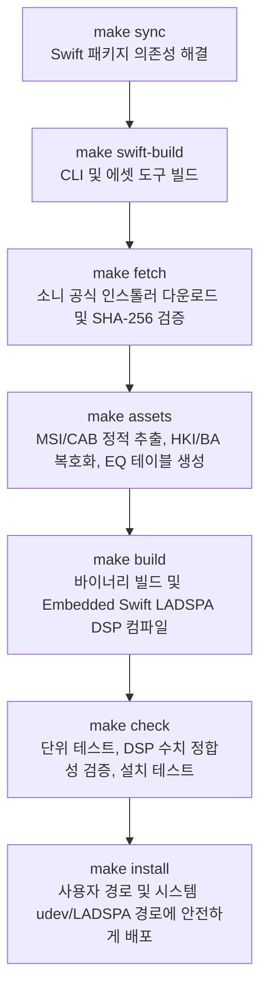

# 저장소 파일 구성 및 자산 수명 주기 (Repository Structure & Asset Lifecycle)

이 문서는 저장소의 디렉터리 구조, 클린룸(Clean-room) 에셋 관리 정책, 빌드 및 배포 파이프라인, 그리고 Git 커밋 시 유의해야 할 파일 관리 수칙을 안내합니다.

---

## 1. 클린룸 구현 정책 (Clean-room Policy)

본 프로젝트는 저작권 및 지적 재산권을 준수하기 위해 **클린룸 역분석 및 재구현(Clean-room Implementation)** 방식을 채택하고 있습니다.

- **원작권 보호**: Sony의 독점 저작물(설치 파일 EXE, MSI, DLL, 암호화된 HRTF HKI, 하드웨어 보정 BA 등)은 Git 저장소에 절대 포함하거나 커밋하지 않습니다.
- **자동화된 로컬 파이프라인**: 런타임에 필요한 오디오 필터와 EQ 계수 테이블은 사용자의 로컬 환경에서 소니 공식 서버로부터 설치 파일을 다운로드하여 무결성을 검증한 후 정적으로 추출합니다.
- **오픈소스 공개 대상**: 순수 자체 작성 코드(Swift 소스, LADSPA 인터페이스, PipeWire/WirePlumber 설정, udev 규칙, 테스트 코드) 및 분석 보고서(JSON/Markdown)만을 공개합니다.

---

## 2. 파일 분류 매트릭스 (File Classification)

| 구분 | Git 저장소 추적 파일 (공개) | 로컬 환경에만 보관 (Git 제외) |
|---|---|---|
| **빌드 & 패키지** | • 최상위 `Makefile`<br>• `native/Makefile`, `native/exports.map`<br>• `Package.swift`, `Package.resolved` | • Swift 빌드 캐시 (`.build/`, `.swiftpm/`)<br>• 컴파일 임시 파일 (`*.o`, `*.tmp`)<br>• 외부 다운로드 캐시 |
| **소스 코드** | • `Sources/` (CLI, TUI, 데몬, HID 제어, 파서 등)<br>• `Sources/InzoneDSP/` (LADSPA DSP 구현)<br>• `Sources/CLADSPA/` (C ABI 시스템 모듈 헤더) | • 빌드된 실행 파일 (`inzone-profile`, `inzone-tools`)<br>• 컴파일된 DSP 라이브러리 (`native/inzone_dsp.so`) |
| **시스템 설정** | • `configs/` (WirePlumber 51/52 설정 파일)<br>• `configs/systemd/` (사용자 서비스 유닛)<br>• `configs/udev/` (`70-inzone-h9-ii.rules`) | • 사용자 런타임 설정 (`~/.config/inzone-h9-ii/`)<br>• 활성 WirePlumber 세션 상태 파일 |
| **개발 도구** | • `Sources/InzoneTools/` (개발/에셋 도구 CLI)<br>• `Sources/InzoneToolsCore/` (추출/설치/진단 코어) | • 로컬 ILSpy 디컴파일러 (`tools/ilspycmd`)<br>• `.dotnet/`, `.nuget/`, `tools/.store/` |
| **분석 데이터** | • `docs/` (기술 분석서 및 아키텍처 문서)<br>• `evidence/installer.json` (공식 URL 및 SHA-256)<br>• `analysis/README.md` | • `downloads/` (공식 설치 EXE/MSI)<br>• `analysis/payload/` (추출된 원본 바이너리)<br>• `analysis/decompiled/` (C# 디컴파일 소스)<br>• 원시 덤프 파일 (`*.asm`, `*.ole`, `*.strings-*.txt`) |
| **오디오 에셋** | 없음 (로컬에서 정적 추출) | • `assets/` (`sony-eq-tables.json`, HRTF/BA 파일 등) |
| **테스트 & 검증** | • `Tests/` (단위·통합·설치 테스트)<br>• `analysis/*.json` (검토 완료된 요약 보고서) | • 원시 오디오 녹음 파일 (`*.wav`, `*.f32`)<br>• 하드웨어 원시 USB HID 패킷 덤프 |
| **백업 데이터** | 없음 | • `backups/`, `~/.local/state/inzone-linux/backups/` |

---

## 3. 빌드 및 에셋 수명 주기 (Lifecycle & Make Targets)

최상위 `Makefile`은 의존성 준비부터 설치까지 체계적인 워크플로우를 제공합니다:



### 주요 Make 타깃 가이드

- **`make` (또는 `make install`)**: 전체 빌드 및 시스템 설치를 진행합니다. 사용자 파일은 현재 계정으로 설치하고, 시스템 경로(`/etc/udev/rules.d`, `/usr/lib/ladspa`) 설치 시에만 안전하게 `sudo`를 호출합니다.
- **`make sync`**: `Package.swift`와 `Package.resolved`를 기반으로 Swift 의존성을 동기화합니다.
- **`make fetch`**: Sony 공식 서버에서 `INZONEHub_Setup_1.0.19.0.exe`를 다운로드하고 고정된 SHA-256 해시를 검증합니다.
- **`make assets`**: 7-Zip과 ILSpy를 사용하여 설치 파일 내부에서 필요한 HRTF, 모델 보정 필터, 10밴드 EQ 계수 테이블을 `assets/` 디렉터리에 정적 추출합니다. (Windows 바이너리를 직접 실행하지 않습니다)
- **`make native-build`**: `Sources/InzoneDSP/` 코드를 Embedded Swift 모드로 컴파일하여 고성능 경량 LADSPA 플러그인 `native/inzone_dsp.so`를 생성합니다.
- **`make swift-build`**: `inzone-profile` 및 `inzone-tools` 바이너리를 릴리스 모드로 빌드합니다. (Swift 표준 라이브러리 정적 링크)
- **`make check` (또는 `make test`)**: 단위 테스트, 회귀 검증, 설치 안전성 테스트를 수행합니다.
- **`make help`**: 사용 가능한 모든 타깃과 환경 변수 옵션을 출력합니다.

---

## 4. 안전한 설치 메커니즘 (Security Architecture)

본 프로젝트의 설치 도구(`inzone-tools install-all`)는 일반 사용자 권한과 루트 권한을 철저히 분리하여 보안 사고를 예방하도록 설계되었습니다:

1. **최소 권한 원칙**: 전체 프로세스를 `sudo make`로 실행할 필요가 없습니다. 대부분의 파일(실행 파일, 설정, 프로파일)은 일반 사용자 계정 권한(`~/.local/bin`, `~/.config`)으로 원자적(atomic) 교체됩니다.
2. **바이너리 변조 방지 (memfd sealing)**: 시스템 권한(`sudo`)이 필요한 udev 규칙과 시스템 LADSPA 플러그인은, 프로세스가 메모리 파일 디스크립터(Linux `memfd`)에 복사한 후 파일 봉인(File Sealing)을 적용하고 SHA-256 다이제스트를 검증한 뒤 루트 프로세스로 넘깁니다. 이를 통해 `sudo` 암호를 입력하는 도중 원본 파일이 변조되는 보안 취약점을 원천 차단합니다.
3. **기존 설정 보존 및 자동 백업**: 재설치 시 사용자가 직접 수정한 커스텀 프로파일(`51-inzone-h9-ii.conf`), DSP 설정(`profile-settings.json`), 자동 전환 규칙(`auto-profiles.json`)은 안전하게 보존되며, 덮어쓰기 전 기존 파일은 `~/.local/state/inzone-linux/backups/`에 자동 백업됩니다.

---

## 5. 자주 쓰는 빌드 변수

- **오프라인 빌드**: 이미 다운로드받은 설치 파일이 있거나 네트워크가 제한된 환경인 경우:
  ```sh
  make assets FETCH_FLAGS=--offline
  ```
- **별도 경로의 인스톨러 지정**:
  ```sh
  make assets FETCH_FLAGS='--installer /path/to/INZONEHub_Setup_1.0.19.0.exe'
  ```
- **특정 Swift 도구체인 지정**:
  ```sh
  make SWIFT=/opt/swift/usr/bin/swift SWIFTC=/opt/swift/usr/bin/swiftc
  ```

---

## 6. Git 커밋 전 위생 수칙 (Git Hygiene)

저장소에 비공개 라이선스 파일이나 불필요한 대용량 바이너리가 실수로 포함되지 않도록 커밋 전 확인하는 습관을 권장합니다:

```sh
# 1. 무시 대상 파일들이 정상적으로 제외되어 있는지 확인
git status --short --ignored

# 2. 스테이징된 파일 목록 중 바이너리(.exe, .dll, .so, .cab, .hki 등)가 없는지 확인
git ls-files --stage
```

만약 실수로 로컬 전용 파일이 Git 추적 대상에 포함되었다면:
```sh
# 로컬 파일은 유지하면서 Git 추적만 안전하게 해제
git rm --cached <파일명>
```
