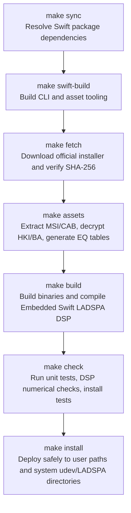

# Repository Structure & Asset Lifecycle

This document describes the repository layout, local static-analysis policy,
build and deployment pipeline, and Git hygiene rules for contributors.

---

## 1. Static Analysis and Publication Policy

The repository keeps Sony-derived binaries and decoded assets outside Git and
uses them only through a local static-analysis pipeline:

- **Copyright Protection**: Proprietary Sony binary deliverables (installer EXE, MSI, DLL, encrypted HRTF HKI, hardware correction BA files, etc.) are never tracked or committed to the Git repository.
- **Automated Local Pipeline**: Required audio filters and EQ coefficient tables are downloaded directly from Sony official servers on the user's machine, verified with fixed SHA-256 digests, and statically extracted without running Windows executables.
- **Analysis Inventory**: `reverse-engineering-inventory.json` records the `implemented-non-account-features` scope, selected managed source types, and feature payloads with their size and SHA-256. Firmware-related files are cataloged as `catalog-only-do-not-execute`.
- **Runtime Boundary**: Firmware updater executables and firmware payloads are not installed. The pinned `inzonevirtualizer.dll` is retained as non-executable decoder input for local personalization import; Windows PE files are not accepted as the Linux application executable.
- **Open-Source Deliverables**: Git contains independently written Swift source, the LADSPA interface, PipeWire/WirePlumber configurations, udev rules, tests, and reviewed technical summaries.

---

## 2. File Classification Matrix

| Category | Tracked in Git (Public) | Local Machine Only (Git Excluded) |
|---|---|---|
| **Build & Packaging** | • Top-level `Makefile`<br>• `native/Makefile`, `native/exports.map`<br>• `Package.swift`, `Package.resolved` | • Swift build caches (`.build/`, `.swiftpm/`)<br>• Compilation temporaries (`*.o`, `*.tmp`)<br>• External download caches |
| **Source Code** | • `Sources/` (CLI, TUI, daemon, HID control, parsers)<br>• `Sources/InzoneDSP/` (LADSPA DSP implementation)<br>• `Sources/CLADSPA/` (C ABI system module headers) | • Built executables (`inzone-profile`, `inzone-tools`)<br>• Compiled DSP library (`native/inzone_dsp.so`) |
| **System Configuration** | • `configs/` (WirePlumber 51/52 config templates)<br>• `configs/systemd/` (User service units)<br>• `configs/udev/` (`70-inzone-h9-ii.rules`) | • User runtime configurations (`~/.config/inzone-h9-ii/`)<br>• Active WirePlumber session state files |
| **Development Tools** | • `Sources/InzoneTools/` (Developer/asset CLI)<br>• `Sources/InzoneToolsCore/` (Extraction/install/diagnostic core) | • Local ILSpy decompiler (`tools/ilspycmd`)<br>• `.dotnet/`, `.nuget/`, `tools/.store/` |
| **Analysis Data** | • `docs/` (Technical specifications and architecture docs)<br>• `evidence/installer.json` (Official URLs and SHA-256)<br>• `analysis/README.md` | • `downloads/` (Official installer EXE/MSI)<br>• `analysis/payload/` (Pinned, publishable feature payloads; updater bytes excluded)<br>• `analysis/decompiled/` (Selected decompiled C# sources)<br>• `analysis/reverse-engineering-inventory.json` (catalog metadata, including updater hashes)<br>• Raw dumps (`*.asm`, `*.ole`, `*.strings-*.txt`) |
| **Audio Assets** | None (Statically extracted locally) | • `assets/` (`sony-eq-tables.json`, HRTF/BA files, etc.) |
| **Test & Verification** | • `Tests/` (Unit, integration, installation tests)<br>• Selected tracked `analysis/*-results.json` and device-write summaries | • Unreviewed generated JSON<br>• Raw audio recordings (`*.wav`, `*.f32`)<br>• Raw USB HID packet traces |
| **Backup Data** | None | • `backups/`, `~/.local/state/inzone-linux/backups/` |

---

## 3. Build & Asset Lifecycle (Make Targets)

The top-level `Makefile` provides a structured workflow from dependency resolution to system installation:



### Make Target Reference

- **`make` (or `make install`)**: Executes the complete build and system installation. Deploys user files under the current account, invoking `sudo` safely only when writing to system directories (`/etc/udev/rules.d`, `/usr/lib/ladspa`).
- **`make sync`**: Synchronizes Swift package dependencies based on `Package.swift` and `Package.resolved`.
- **`make fetch`**: Downloads `INZONEHub_Setup_1.0.19.0.exe` from Sony official servers and verifies its fixed SHA-256 digest.
- **`make assets`**: Uses pinned 7-Zip and ILSpy tooling to statically extract required HRTF filters, model correction filters, and 10-band EQ coefficient tables into `assets/` without executing Windows binaries. It also writes `analysis/reverse-engineering-inventory.json`. Generated assets and the managed payload set are staged and published by directory exchange only after all transformations succeed; exact known updater payload names are removed from the published payload set.
- **`make native-build`**: Compiles `Sources/InzoneDSP/` in Embedded Swift mode to generate the high-performance, lightweight LADSPA plugin `native/inzone_dsp.so`.
- **`make swift-build`**: Builds release binaries for `inzone-profile` and `inzone-tools` with a statically linked Swift standard library.
- **`make check` (or `make test`)**: Runs unit tests, regression suites, and installation safety tests.
- **`make help`**: Prints all available targets and configuration variables.

A user-supplied `--ilspycmd` must be a regular host ELF64 x86-64 executable with
an executable `PT_LOAD` segment. The extractor rejects PE input and executes the
validated open inode through `/proc/<parent-pid>/fd/<descriptor>` so a path swap
cannot select a different tool after validation.

---

## 4. Safe Installation Mechanism (Security Architecture)

The installer (`inzone-tools install-all`) separates user-owned installation
steps from the fixed system-path writes that require root:

1. **Principle of Least Privilege**: Running `sudo make` is unnecessary and discouraged. Nearly all files (binaries, configurations, profiles) are atomically deployed under regular user permissions (`~/.local/bin`, `~/.config`).
2. **Bound System-file Snapshots (memfd sealing)**: For system files requiring root access (udev rules and LADSPA plugins), the process copies contents into Linux sealed anonymous memory file descriptors (`memfd`), verifies SHA-256 digests, and passes those descriptors to the root helper. The helper installs the reviewed byte snapshots instead of reopening mutable source paths after `sudo` authentication.
3. **Complete FIR-bank Publication**: The installer builds and validates the standard and downmix banks in a private staging directory, including eight WAV files, `fir-bank.bin`, and the manifest. It exchanges the complete asset directory atomically and retains the previous directory until held readers can finish. A later publication failure exchanges the previous bank back.
4. **Configuration Preservation & Automatic Backups**: User-customized WirePlumber profiles (`51-inzone-h9-ii.conf`), DSP configurations (`profile-settings.json`), custom profiles (`sound-profiles.json`), and auto-switch rules (`auto-profiles.json`) are preserved across reinstallation. Previous managed configurations are backed up to `~/.local/state/inzone-linux/backups/` before replacement.

Atomic replacement describes runtime directory visibility and rollback on reported
errors. It does not claim a journaled transaction that survives power loss between
all user, system, and live-session steps.

---

## 5. Common Build Variables

- **Offline Build**: When the installer has already been downloaded or in air-gapped environments:
  ```sh
  make assets FETCH_FLAGS=--offline
  ```
- **Custom Installer Path**:
  ```sh
  make assets FETCH_FLAGS='--installer /path/to/INZONEHub_Setup_1.0.19.0.exe'
  ```
- **Custom Swift Toolchain**:
  ```sh
  make SWIFT=/opt/swift/usr/bin/swift SWIFTC=/opt/swift/usr/bin/swiftc
  ```

---

## 6. Git Hygiene Guidelines

Ensure proprietary assets or unnecessary large build artifacts are not accidentally committed:

```sh
# 1. Verify ignored files are cleanly excluded
git status --short --ignored

# 2. Inspect staged files to ensure no binaries (.exe, .dll, .so, .cab, .hki) are included
git ls-files --stage
```

If a local-only file is accidentally staged:
```sh
# Unstage safely while retaining local file on disk
git rm --cached <filename>
```
