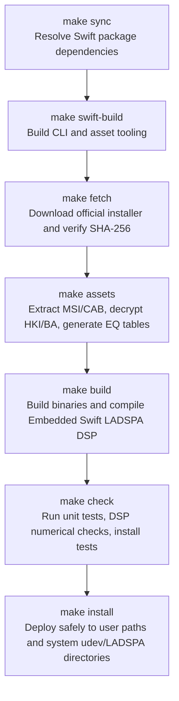

# Repository Structure & Asset Lifecycle

This document describes the repository layout, clean-room asset management policy, build and deployment pipeline, and Git hygiene rules for contributors.

---

## 1. Clean-room Implementation Policy

To strictly comply with copyright and intellectual property laws, this project adopts a **clean-room reverse-engineering and reimplementation** model:

- **Copyright Protection**: Proprietary Sony binary deliverables (installer EXE, MSI, DLL, encrypted HRTF HKI, hardware correction BA files, etc.) are never tracked or committed to the Git repository.
- **Automated Local Pipeline**: Required audio filters and EQ coefficient tables are downloaded directly from Sony official servers on the user local machine, verified with fixed SHA-256 digests, and statically extracted without running Windows executables.
- **Open-Source Deliverables**: Only clean-room written code (Swift source, LADSPA interface, PipeWire/WirePlumber configurations, udev rules, test suites) and technical analysis reports (JSON/Markdown) are published.

---

## 2. File Classification Matrix

| Category | Tracked in Git (Public) | Local Machine Only (Git Excluded) |
|---|---|---|
| **Build & Packaging** | • Top-level `Makefile`<br>• `native/Makefile`, `native/exports.map`<br>• `Package.swift`, `Package.resolved` | • Swift build caches (`.build/`, `.swiftpm/`)<br>• Compilation temporaries (`*.o`, `*.tmp`)<br>• External download caches |
| **Source Code** | • `Sources/` (CLI, TUI, daemon, HID control, parsers)<br>• `Sources/InzoneDSP/` (LADSPA DSP implementation)<br>• `Sources/CLADSPA/` (C ABI system module headers) | • Built executables (`inzone-profile`, `inzone-tools`)<br>• Compiled DSP library (`native/inzone_dsp.so`) |
| **System Configuration** | • `configs/` (WirePlumber 51/52 config templates)<br>• `configs/systemd/` (User service units)<br>• `configs/udev/` (`70-inzone-h9-ii.rules`) | • User runtime configurations (`~/.config/inzone-h9-ii/`)<br>• Active WirePlumber session state files |
| **Development Tools** | • `Sources/InzoneTools/` (Developer/asset CLI)<br>• `Sources/InzoneToolsCore/` (Extraction/install/diagnostic core) | • Local ILSpy decompiler (`tools/ilspycmd`)<br>• `.dotnet/`, `.nuget/`, `tools/.store/` |
| **Analysis Data** | • `docs/` (Technical specifications & architecture docs)<br>• `evidence/installer.json` (Official URLs & SHA-256)<br>• `analysis/README.md` | • `downloads/` (Official installer EXE/MSI)<br>• `analysis/payload/` (Extracted original binaries)<br>• `analysis/decompiled/` (Decompiled C# source)<br>• Raw dumps (`*.asm`, `*.ole`, `*.strings-*.txt`) |
| **Audio Assets** | None (Statically extracted locally) | • `assets/` (`sony-eq-tables.json`, HRTF/BA files, etc.) |
| **Test & Verification** | • `Tests/` (Unit, integration, installation tests)<br>• `analysis/*.json` (Reviewed summary reports) | • Raw audio recordings (`*.wav`, `*.f32`)<br>• Raw USB HID packet traces |
| **Backup Data** | None | • `backups/`, `~/.local/state/inzone-linux/backups/` |

---

## 3. Build & Asset Lifecycle (Make Targets)

The top-level `Makefile` provides a structured workflow from dependency resolution to system installation:



### Make Target Reference

- **`make` (or `make install`)**: Executes the complete build and system installation. Deploys user files under the current account, invoking `sudo` safely only when writing to system directories (`/etc/udev/rules.d`, `/usr/lib/ladspa`).
- **`make sync`**: Synchronizes Swift package dependencies based on `Package.swift` and `Package.resolved`.
- **`make fetch`**: Downloads `INZONEHub_Setup_1.0.19.0.exe` from Sony official servers and verifies its fixed SHA-256 digest.
- **`make assets`**: Uses 7-Zip and ILSpy to statically extract required HRTF filters, model correction filters, and 10-band EQ coefficient tables into `assets/` without executing Windows binaries.
- **`make native-build`**: Compiles `Sources/InzoneDSP/` in Embedded Swift mode to generate the high-performance, lightweight LADSPA plugin `native/inzone_dsp.so`.
- **`make swift-build`**: Builds release binaries for `inzone-profile` and `inzone-tools` with a statically linked Swift standard library.
- **`make check` (or `make test`)**: Runs unit tests, regression suites, and installation safety tests.
- **`make help`**: Prints all available targets and configuration variables.

---

## 4. Safe Installation Mechanism (Security Architecture)

The installer (`inzone-tools install-all`) enforces strict privilege separation between user space and root execution to eliminate security risks:

1. **Principle of Least Privilege**: Running `sudo make` is unnecessary and discouraged. Nearly all files (binaries, configurations, profiles) are atomically deployed under regular user permissions (`~/.local/bin`, `~/.config`).
2. **Binary Tamper Protection (memfd sealing)**: For system files requiring root access (udev rules and LADSPA plugins), the process copies contents into Linux sealed anonymous memory file descriptors (`memfd`), verifies SHA-256 digests, and passes descriptors to the root helper. This eliminates race conditions and time-of-check-to-time-of-use (TOCTOU) tampering while prompting for `sudo`.
3. **Configuration Preservation & Automatic Backups**: User-customized WirePlumber profiles (`51-inzone-h9-ii.conf`), DSP configurations (`profile-settings.json`), and auto-switch rules (`auto-profiles.json`) are preserved across reinstallation. Previous configurations are automatically backed up to `~/.local/state/inzone-linux/backups/` before any atomic replacement.

---

## 5. Common Build Variables

- **Offline Build**: When the installer has already been downloaded or in air-gapped environments:
  ```sh
  make assets FETCH_FLAGS=--offline
  ```
- **Custom Installer Path**:
  ```sh
  make assets FETCH_FLAGS='--installer /path/to/INZONEHub_Setup_1.0.19.0.exe'
  ```
- **Custom Swift Toolchain**:
  ```sh
  make SWIFT=/opt/swift/usr/bin/swift SWIFTC=/opt/swift/usr/bin/swiftc
  ```

---

## 6. Git Hygiene Guidelines

Ensure proprietary assets or unnecessary large build artifacts are not accidentally committed:

```sh
# 1. Verify ignored files are cleanly excluded
git status --short --ignored

# 2. Inspect staged files to ensure no binaries (.exe, .dll, .so, .cab, .hki) are included
git ls-files --stage
```

If a local-only file is accidentally staged:
```sh
# Unstage safely while retaining local file on disk
git rm --cached <filename>
```
