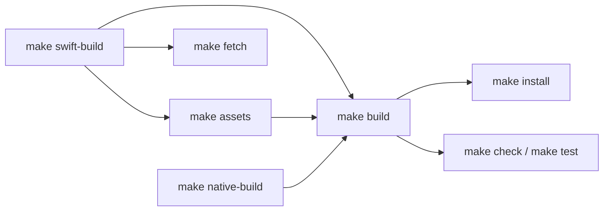

# Repository files and asset lifecycle

This reference covers source files, generated assets, build targets, and
installation behavior. Package installation is documented in
[Debian packaging](debian.md); automated package builds are documented in
[package CI](ci.md).

## Tracked and local files

Sony installers, binaries, and decoded audio assets remain outside Git. Asset
preparation verifies the pinned installer from Sony's servers and extracts the
required filters and EQ tables locally without executing Windows binaries.
The repository contains application source, the LADSPA interface, desktop and
audio configuration, tests, and reviewed analysis summaries.

| Category | Tracked files | Local files excluded from Git |
| --- | --- | --- |
| Build and packaging | `Makefile`, `CMakeLists.txt`, `CMakePresets.json`, `Package.swift`, `Package.resolved`, `.github/workflows/`, `cmake/`, `packaging/`, `scripts/`, `native/Makefile`, `native/exports.map` | `.build/`, `.swiftpm/`, `build/`, `.deb` packages, object files, temporary files, and download caches |
| Application source | `Sources/`, including CLI, TUI, GUI, D-Bus, HID, parsers, `InzoneDSP`, and `CLADSPA` | Built executables and `native/inzone_dsp.so` |
| Configuration | `configs/` audio templates, `configs/systemd/`, `configs/dbus/`, `configs/udev/70-inzone-h9-ii.rules`, and `gui/` QML, desktop entry, and icon | `~/.config/inzone-h9-ii/` and active WirePlumber session state |
| Asset and installation tools | `Sources/InzoneTools/`, `Sources/InzoneToolsCore/` | `tools/ilspycmd`, `tools/.store/`, `.dotnet/`, and `.nuget/` |
| Analysis | `docs/`, `evidence/installer.json`, and `analysis/README.md` | `downloads/`, `analysis/payload/`, `analysis/decompiled/`, `analysis/reverse-engineering-inventory.json`, disassembly, and raw dumps |
| Audio assets | No Sony audio assets | `assets/`, including EQ tables, HRTF data, and correction filters |
| Validation | `Tests/` and selected reviewed `analysis/*-results.json` and device-write summaries | Unreviewed generated JSON, raw audio (`*.wav`, `*.f32`), and USB HID traces |
| Backups | None | `backups/` and `~/.local/state/inzone-linux/backups/` |

`analysis/reverse-engineering-inventory.json` records the
`implemented-non-account-features` scope, selected managed source types, and
feature payload sizes and SHA-256 hashes. Firmware-related entries are marked
`catalog-only-do-not-execute`. Updater payloads are excluded from the retained
feature payload set and are not installed or executed.

The pinned `inzonevirtualizer.dll` remains non-executable input for local
personalization decoding. Windows PE files are not accepted as Linux
application executables.

## Build targets

Run project builds as the desktop user. These arrows show prerequisite
relationships in the top-level [Makefile](../Makefile):


```mermaid
flowchart LR
    S[make swift-build] --> A[make assets]
    S --> F[make fetch]
    S --> B[make build]
    A --> B
    N[make native-build] --> B
    B --> I[make install]
    B --> C[make check / make test]
```

`make install` builds and installs the stack. Run `make check` separately to
execute tests before installation.

| Command | Behavior |
| --- | --- |
| `make` or `make install` | Prepare assets, build the stack, and install user files; request `sudo` for the system udev and LADSPA files |
| `make sync` | Resolve Swift dependencies using `Package.swift` and `Package.resolved` |
| `make fetch` | Download `INZONEHub_Setup_1.0.19.0.exe` and verify its fixed SHA-256; do not extract it |
| `make assets` | Prepare filters and EQ tables, the retained payload set, and the analysis inventory |
| `make native-build` | Compile `Sources/InzoneDSP/` as the Embedded Swift LADSPA plugin `native/inzone_dsp.so` |
| `make swift-build` | Build the CLI, setup utility, and service with a statically linked Swift runtime |
| `make swift-test` | Build the DSP plugin and run Swift tests without preparing Sony assets; asset-dependent tests may skip |
| `make check` or `make test` | Prepare assets, build, and run Swift tests without installing |
| `make gui-build`, `make gui-test`, `make gui-install` | Build, test, or install the Qt desktop and D-Bus service; see [GUI documentation](gui.md) |
| `make gui-wayland-test` | Run the isolated native Wayland suite; see [Wayland validation](wayland.md) |
| `make deb` | Build a Debian package with its Swift runtime; see [Debian packaging](debian.md) |
| `make help` | Print targets and configuration variables |

The [Debian packages workflow](ci.md) is configured to build and verify `trixie`
and `forky` amd64 packages. Sony asset preparation remains a separate user step.

## Asset preparation

Extraction uses an installed `7zz` or `7z` and a pinned ILSpy version. It
statically extracts HRTF filters, model correction filters, and ten-band EQ
tables. The prepared assets and retained payloads are staged before publication.
Directory exchanges publish the completed data only after every transformation
succeeds. Known updater payload names are removed from the retained set.

A supplied `--ilspycmd` must be a regular ELF64 executable for the host
architecture with an executable `PT_LOAD` segment. The extractor rejects PE
files and runs the validated open inode through
`/proc/<parent-pid>/fd/<descriptor>`. Replacing the source pathname after
validation does not change the executable selected for that operation.

## Installation behavior

`inzone-tools install-all` writes user files before requesting administrator
privileges for fixed system paths. User files go under `~/.local/bin`,
`~/.local/share`, and `~/.config`. System writes target `/etc/udev/rules.d` and
`/usr/lib/ladspa`. Do not run the build with `sudo make`.

The installer copies the root helper executable, DSP plugin, and udev rule into
sealed `memfd` snapshots. It verifies the source hashes and passes the snapshots
to the privileged helper instead of reopening source paths after authentication.

For each asset-bank update, the installer builds and validates the standard and
downmix banks in a private staging directory, including eight WAV files,
`fir-bank.bin`, and the manifest. It exchanges that directory with the installed
bank and retains the previous bank for existing readers. A later publication
failure restores the previous bank.

Reinstallation preserves `profile-settings.json`, `sound-profiles.json`, and
`auto-profiles.json`. It regenerates the active WirePlumber profile and the
selected filter-chain fragment under `~/.config/inzone-h9-ii/filter-chain.conf.d/`.
Existing managed files are backed up under
`~/.local/state/inzone-linux/backups/` before replacement.

### Audio service lifecycle

`inzone-filter-chain.service` reads its base configuration and active fragment
from `~/.config/inzone-h9-ii/`. User setup enables it through
`~/.config/systemd/user/default.target.wants/`.

Profile changes restart this service and WirePlumber while PipeWire and
pipewire-pulse remain running. The controller parks playback streams from INZONE
outputs on a temporary null sink, restores their selected or explicit original
routes, and removes the temporary sink.

When upgrading the former daemon DSP configuration, the source installer backs
up `~/.config/pipewire/pipewire.conf.d/51-inzone-h9-ii-dsp.conf` and replaces it
with `{}`. It restarts desktop audio once to unload the old daemon filter
modules. Debian package installation and `inzone-tools setup` do not restart
audio; see [package setup](debian.md) for activation steps.

Atomic replacement provides runtime visibility and rollback after reported
errors. It does not provide a journaled transaction across user files, system
files, and audio services that survives every power failure.

## Build configuration examples

Offline asset preparation requires the installer, Swift dependencies, and
extraction tools to be available locally:

```sh
make assets FETCH_FLAGS=--offline
```

Use an existing installer file:

```sh
make assets FETCH_FLAGS='--installer /path/to/INZONEHub_Setup_1.0.19.0.exe'
```

Select a Swift toolchain:

```sh
make SWIFT=/opt/swift/usr/bin/swift SWIFTC=/opt/swift/usr/bin/swiftc
```

## Review files before committing

Check ignored files and the staged file list before publishing changes:

```sh
git status --short --ignored
git ls-files --stage
```

Keep proprietary installers, DLLs, encrypted filters, decoded assets, raw
captures, and build output out of Git. If a local file was staged accidentally,
untrack it while retaining the local copy:

```sh
git rm --cached <filename>
```
