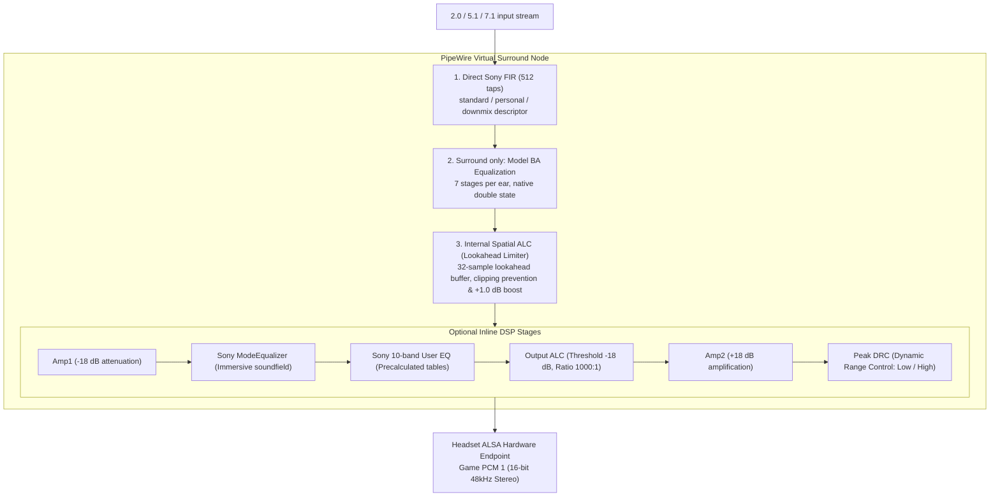
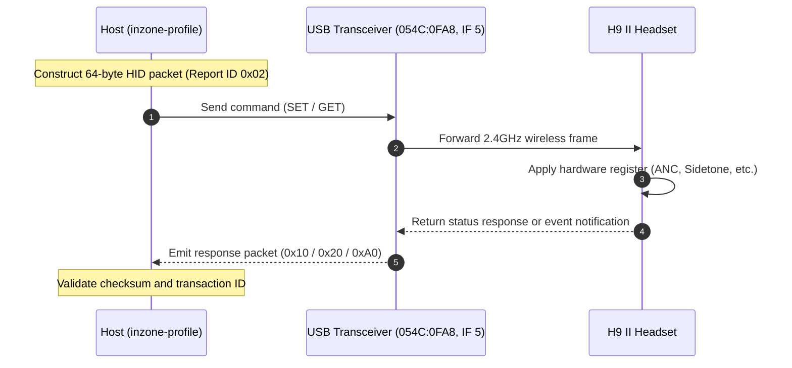

# Sony INZONE Hub 1.0.19.0 & H9 II Reverse Engineering Technical Specification

This document presents a technical analysis of Sony official utility, **INZONE Hub 1.0.19.0**, and the **INZONE H9 II (MDR-G900N / Model Code YY2987)** wireless gaming headset, detailing the audio DSP algorithms and USB HID control protocol reverse-engineered to implement the native Linux (PipeWire / WirePlumber / Swift LADSPA) driver stack.

---

## 1. Provenance & Asset Integrity

- **Official Support Page**: [Sony MDR-G600/G900N Software Support](https://support.sony.jp/electronics/support/headphones-gaming-headphones/mdr-g600/software/00384248)
- **Official Installer Download URL**: `https://info.update.sony.net/HP002/APID001WN00/contents/0011/INZONEHub_Setup_1.0.19.0.exe`

### 1.1. Key Binaries & Assets SHA-256 Digest Matrix

| Filename | File Size (Bytes) | SHA-256 Checksum | Description |
|---|---|---|---|
| `INZONEHub_Setup_1.0.19.0.exe` | 144,916,520 | `8cb73e7524281905ec3e5f52679bb757557ee069571ec8c68ceff89d0edd2540` | Official InstallShield setup package |
| Embedded MSI (`Data1.msi`) | 136,132,608 | `4c4ad6278dbbf29f231c091697c2a73e279ad211acadc4ee5edb5be85f22e35b` | Located at offset `7,212,312` |
| `inzonehub.dll` | 38,122,120 | `77082a578f25b2ef6722e256fd7f53de0d69678a8c852a7aaf4e8f569c542a5f` | .NET Core managed UI & business logic |
| `inzonevirtualizer.dll` | 2,453,600 | `d3fb1a9619335af6f8256029714ac57ba53d643fb4ce9f43d8d50e3a20179860` | x86-64 native audio DSP engine |
| `shp_for_game_v2.0_512tap.hki` | 57,952 | `1a5ab53581ddb5320c2475fcb85cd6243c0b7472bbe339f14dc03c90bd8cf62d` | Sony baseline 7.1 spatial audio HRTF |
| `wh_g910n_standard.ba` | 192 | `9d9faae35a2db1ed16d277dbb73ea0e4e2bd96d85df5258593acf1dabf0797e2` | 7-stage IIR hardware correction filter for H9 II |
| `downmix.hki` | 57,952 | `7f4bdc12b3885435a6305c9c138f3d66ee7da00874bdce7b5f0e12c21da9cdac` | Stereo downmix filter container |
| `control.yaml` | 3,283 | `859c9cc66538ab11156783199c2dcd19687895e72e48e4693799389c9aab4621` | Immersive soundfield coefficient definitions |

### 1.2. Installer Payload Structure
The InstallShield executable embeds an MSI database at file offset `7,212,312`, containing `Data1.cab` from which runtime components can be extracted statically.
- Analysis of the MSI `File` table shows that `shp_for_game_v2.0_512tap.hki` maps to `standard_hrtf.hki` at runtime.
- In the managed assembly, `ApoFileCommunication.SetVirtualizer` binds `standard_hrtf.hki` and `wh_g910n_standard.ba` together when non-personalized spatial surround is enabled.
- When spatial surround is disabled, `downmix.hki` is loaded and the model BA correction filter is bypassed.

The extraction workflow does not execute the Windows installer, PE payloads, or
firmware tools. It runs pinned 7-Zip and ILSpy tooling against copied input in a
private staging directory. `inzone-tools export-inventory` records the selected
managed types and feature payloads with their size and SHA-256. Firmware-related
artifacts are included only in a `catalog-only-do-not-execute` inventory and are
never exported as runtime assets.

---

## 2. Native Audio Engine Analysis (`inzonevirtualizer.dll`)

`inzonevirtualizer.dll` is an x86-64 PE32+ native binary with an Image Base of `0x180000000`.

### 2.1. Key Functions & Data Tables RVA Mapping

| Subroutine / Symbol | RVA | Analysis & Functionality |
|---|---|---|
| **HKI Key Derivation** | `0x9480` | Selector length table: `0x1f6ab0`, Pointer table: `0x1f6ab8` |
| **BA Key Derivation** | `0x10c80` | 20-word constant table: `0x1f7d80` |
| **AES-128-CBC Decryption Routine** | `0x11520` | Standard AES-CBC decryption and PKCS#7 padding unpad |
| **MD5 Integrity Verification** | `0x117f0` | Compares MD5 of decrypted plaintext against header checksum |
| **Spatial Convolution Engine Init** | `0x1840` / `0x2610` | Ring buffer allocation and FIR filter state initialization |
| **Spatial Audio Realtime Rendering** | `0x2c90` | Per-channel 512-tap FIR convolution processing |
| **Internal Spatial ALC Init / Process** | `0xd5e0` / `0xd8b0` | 8-frame block processing, 32-sample lookahead delay line |
| **Output ALC (External Dynamic Limiter)** | `0x11a90` / `0x11be0` | Output auto level control using 10 ms peak detection |
| **Peak DRC (Dynamic Range Control)** | `0x18880` / `0x18af0` | Upward compression and expansion curve dynamics |
| **Model BA Biquad Kernel** | `0x11210` | 7-stage cascaded IIR Biquad (internal `double` precision state) |
| **User 10-Band EQ Kernel** | `0x155c0` | 10-band parametric Biquad EQ (`float32` state) |
| **Equalizer::SetParameters** | `0x19ae0` | Precalculated `coefficients` take precedence over dynamic parameter recalculations |

The recovered spatial path performs direct convolution. The Linux implementation
therefore uses three direct FIR LADSPA descriptors rather than PipeWire's built-in
convolver: `inzone_fir_standard` (descriptor 6), `inzone_fir_personal`
(descriptor 7), and `inzone_fir_downmix` (descriptor 8). Each has eight ordered
speaker inputs, two ear outputs, and a zero-valued FIR latency port. The 32-frame
graph latency comes from the following spatial ALC stage.

The plugin resolves one data root before loading a complete coefficient bank:
`INZONE_DSP_DATA_DIR` when explicitly set for a controlled test, otherwise
`$HOME/.local/share/inzone-linux`. Graph generation rejects an asset directory
that does not match its configured FIR data root, so validation and runtime load
cannot silently refer to different banks.

The `preamp` fields in the managed `control.yaml` path are parsed and written by
the Hub, but the analyzed native DSP path does not consume them. Preserving that
native behavior requires no separate preamp stage.

### 2.2. Encryption Key Derivation Algorithm
Sony symmetric encryption keys are not stored in plaintext; they are derived at runtime using file header metadata combined with internal obfuscation tables:

1. **Table Lookup**: The file header `uint32` marker determines the selector table offset in the DLL data section.
2. **XOR Transformation**: Marker and table entries are combined using modulo index arithmetic.
3. **Byte Rotation Loop**: A 16-step byte permutation and rotation loop generates a 16-byte (128-bit) symmetric key block.
4. **Endian Swapping**: Preceding AES decryption, each 4-byte group is reversed to match expected endianness.
5. **Initialization Vector (IV) & Decryption**: The 16-byte checksum field in the file header is supplied directly as the IV for AES-128-CBC. Following decryption, PKCS#7 padding is validated and stripped, and the MD5 hash of the plaintext is verified against the header checksum.

---

## 3. Proprietary Filter File Formats (HKI & BA)

### 3.1. HKI (Head-Related Impulse Response Container)
A binary container housing Head-Related Transfer Function (HRTF) FIR filter tap coefficients:

- **Header Layout (144 bytes)**:
  - `0x00`: Magic identifier `hki2`
  - `0x04`: Key table marker (`uint32_le`)
  - `0x08`: Plaintext MD5 checksum & AES IV (16 bytes)
  - `0x38`: Sample rate (`48000` Hz)
  - `0x3C`: Number of ears (`2`: Left, Right)
  - `0x4C`: Cipher mode (`5`: Standard asset, `7`: Personalized profile)
  - `0x50`: Cipher 7 PRNG initial seed offset
  - `0x58`: Tap count (`512`)
  - `0x5C`: Declared direction count (`14` in the pinned standard and downmix H9 II assets)
  - `0x90`: Start of AES-128-CBC encrypted payload
- **Payload Structure**:
  - The pinned stock plaintext size is 57,792 bytes (14 directions × 2 ears × (16-byte metadata + 512 taps × 4-byte float32)).
  - Each record contains a 16-byte header (`azimuth`, `polar`, `kind`, `ear`) followed by 512 `float32` FIR coefficients.

The 14 records per ear are source metadata, not 14 runtime speaker ports. The H9
II renderer selects the eight coordinates in the channel table below. The other
six directions remain in the manifest for provenance. Standard stock export
requires exactly 14 unique paired directions. Personalized input may declare a
different valid paired direction count, but import requires all eight renderer
coordinates and preserves every decoded unique direction in its manifest.

### 3.2. BA (Biquad Array Correction Filter)
A cascaded IIR Biquad filter correcting the acoustic characteristics of the headset drivers:

- **Header Layout (48 bytes)**:
  - `0x00`: Magic identifier `ba00`
  - `0x04`: Key marker (`uint32_le`)
  - `0x08`: Plaintext MD5 hash & AES IV (16 bytes)
  - `0x18`: Sample rate (`48000` Hz)
  - `0x1C`: Number of Biquad sections (`7`)
- **Payload**: Decrypted plaintext size is exactly 140 bytes (7 stages × 5 coefficients `b0, b1, b2, a1, a2`).
- **Stability Verification**:
  Transfer function $H(z) = \frac{b_0 + b_1 z^{-1} + b_2 z^{-2}}{1 + a_1 z^{-1} + a_2 z^{-2}}$ was analyzed mathematically. All poles for the pinned coefficient set reside strictly within the complex unit circle ($|z| < 1$). Import rejects non-finite, out-of-range, or unstable coefficients separately.

---

## 4. Audio Channel Mapping & PipeWire Integration

### 4.1. 7.1ch Channel & HKI Angle Mapping Matrix

| PipeWire Channel | HKI Azimuth | HKI Polar | Acoustic Position |
|---|---|---|---|
| **FL** (Front Left) | 330° | 90° | 30° Front-Left |
| **FR** (Front Right) | 30° | 90° | 30° Front-Right |
| **FC** (Front Center) | 0° | 90° | Front-Center |
| **LFE** (Low Frequency Effect) | 0° | 0° | Subwoofer (Omnidirectional Low-End) |
| **RL** (Rear Left) | 210° | 90° | 150° Rear-Left |
| **RR** (Rear Right) | 150° | 90° | 150° Rear-Right |
| **SL** (Side Left) | 250° | 90° | 110° Side-Left |
| **SR** (Side Right) | 110° | 90° | 110° Side-Right |

### 4.2. Game/Chat Hardware Dual Stream Isolation
The INZONE H9 II transceiver provides two playback PCM streams over a single USB device:
- **PCM 0 (Interface 1)**: Chat stream (communications)
- **PCM 1 (Interface 4)**: Game stream (gaming & primary desktop audio)

Default Linux sound configurations often erroneously bind primary desktop audio to PCM 0. This project installs a dedicated WirePlumber configuration rule (`52-inzone-game-chat.conf`) to ensure spatial audio routing binds strictly to the Game stream (PCM 1).

### 4.3. Layout-specific Virtual Sinks

| Input layout | Surround HRTF sink | Surround-off downmix sink |
|---|---|---|
| `FL FR` | `inzone.sony-surround.stereo` | `inzone.sony-downmix` |
| `FL FR FC LFE SL SR` | `inzone.sony-surround.5.1` | `inzone.sony-downmix.5.1` |
| `FL FR FC LFE RL RR SL SR` | `inzone.sony-surround` | `inzone.sony-downmix.7.1` |

All six sinks render stereo to the physical Game endpoint. Surround profiles make
the 7.1 surround sink the default. Ordinary non-voice profiles make the stereo
downmix sink the default. Voice targets the physical Chat endpoint, and Restore
targets the physical Game endpoint. Missing FIR ports in the 2.0 and 5.1 graphs
are processed as exact zero instead of being synthesized by automatic upmix.

The recovered `downmix.hki` bank is a delta matrix. `FL` and `FR` feed their own
ears at unity. `FC` feeds both ears at approximately −3.01 dB. `SL` and `RL` feed
the left ear at approximately −3.01 dB, while `SR` and `RR` feed the right ear at
the same level. `LFE` is discarded. All taps after the first are zero. The FIR
therefore reports zero latency; the following spatial ALC contributes the graph's
declared 32-frame latency.

---

## 5. DSP Signal Processing Pipeline Architecture

Real-time processing is handled through PipeWire `filter-chain` and a high-performance LADSPA plugin (`native/inzone_dsp.so`) compiled with Embedded Swift:



For surround, the graph is direct HRTF FIR → seven model biquads per ear →
spatial ALC → DRC. For surround-off Game profiles, it is direct `downmix.hki`
FIR → spatial ALC. The downmix graph deliberately omits the model BA and its
internal DRC. Optional profile EQ, sound mode, output ALC, and DRC remain separate
inline graphs attached to the target output rule.

### 5.1. Numerical Precision (ULP) Preservation
Sony original engine evaluates $-18\text{ dB}$ attenuation and $+18\text{ dB}$ recovery using single-precision floating-point constants `powf(10.0f, ±18.0f / 20.0f)`:
- `Amp1`: `0.1258925497531891`
- `Amp2`: `7.943282127380371`
Evaluating these via double-precision and casting to float introduces a 1-ULP deviation in the least significant mantissa bit. The Linux implementation stores the recovered single-precision constants directly. This establishes those two constants only; it does not establish bit identity for the complete Windows DSP engine.

---

## 6. Linux PipeWire Integration Challenges & Solutions

### 6.1. PipeWire 1.6.8 filter-graph Descending Execution Quirk
Source code inspection of PipeWire 1.6.8 `audioconvert` revealed that filter graphs execute nodes in descending order of node index. Direct chronological definition caused DRC and EQ execution order to invert.
- **Solution**: The WirePlumber configuration generator (`GraphRenderer.swift`) reverses node index assignments relative to intended execution order, ensuring runtime evaluation follows the correct forward sequence (`Amp1` → `ModeEQ` → `EQ` → `ALC` → `Amp2` → `DRC`).

### 6.2. 4096-Byte Property Parsing Buffer Limitation
PipeWire `parse_prop_params()` uses an internal 4096-byte buffer when parsing node properties. Combining 10-stage Biquad parameters, DRC configuration, and ALC settings in a single JSON payload exceeded this buffer limit, causing silent filter failures.
- **Solution**: The signal graph is partitioned into modular subgraphs where each parameter chunk remains safely under the 4096-byte threshold.

---

## 7. USB HID Hardware Control Protocol

Headset hardware settings (ANC, Sidetone, Game/Chat balance, etc.) are controlled via USB Interface 5 using vendor-specific HID reports:

- **Device ID**: `054C:0FA8`, Interface 5, Usage Page `0xFF04`
- **Report Structure**: Fixed 64 bytes, Report ID `0x02`

```
[0x02] [Len] [0x01] [0x00, 0xFC] [ParamLen] [0x96, 0xC3] [Address] [EventID] [Type] [TxID] [Payload...] [Checksum] [0x00...]
```

- `Sony Key`: Fixed `0xC396` (Little-endian: `0x96, 0xC3`)
- `Address`: Target/source address byte `(Target << 4) | Source` (Headset: `0x41`, Transceiver: `0x21`)
- `Checksum`: Sum of bytes from `Sony Key` through end of `Payload` modulo 256



### 7.1. Key Hardware Event IDs

GET transactions require a `RET` (`0x10`) response; SET transactions require a
matching `NTFY` (`0x20`) response. Event ID, source address, and transaction ID
must also match. An unsolicited `NTFY_ACTIVE` (`0xA0`) does not complete either
transaction.

After SET acknowledgement, the client polls GET readback for up to 1.5 seconds.
A mismatching readback waits up to 50 ms before the next query. The SET command
is not retransmitted. Verification succeeds only when the requested field matches;
otherwise the error includes the field, requested value, and last observed value.
This handles temporary stale readback without hiding persistent device rejection.
The H9 II accepts `ambient_level` and `voice_focus` changes while Event 65 is in
Ambient mode; callers changing those values must select `anc=2` first.

| Field | Event ID | Index | Valid Values | Description |
|---|---|---|---|---|
| `headphone_volume` | 33 | 1 | 0 to 30 | Headset hardware playback level |
| `anc` | 65 | 0 | 0, 1, 2 | 0: Off, 1: Noise Canceling (NC), 2: Ambient Sound |
| `ambient_level` | 65 | 1 | 1 to 20 | Ambient Sound microphone volume level |
| `voice_focus` | 65 | 3 | 0, 1 | 0: Voice Focus Off, 1: Voice Focus On |
| `game_chat` | 34 | 0 | 0 to 100 in steps of 10 | Game / Chat balance ratio (50: Center) |
| `sidetone` | 35 | 0 | 0 to 10 | Real-time microphone monitoring volume (0 to 10) |
| `toggle_*` | 66 | 0–2 | 0, 1 | Headset physical button cycle mode mask |
| `nc_startup` | 67 | 0 | 0 to 3 | Power-on NC default (0: Off, 1: NC, 2: Ambient, 3: Last State) |
| `bt_startup` | 99 | 0 | 0 to 2 | Power-on Bluetooth default |
| `auto_power` | 129 | 0 | 0, 5, 15, 30, 60, 180 | Standby auto-power-off timer (minutes, 0: Disabled) |
| `language` | 131 | 0 | 0 to 2 | Voice guidance language |
| `guidance` | 132 | 0 | 0, 1 | Operation tones and voice guidance |
| `battery` | 4 | - | 0 to 100 | Battery level & charging state (Read-only) |
| `firmware` | 3 | - | String | Headset and transceiver firmware versions (Read-only) |

Event 33 byte 0 reports headphone mute, but the H9 II Hub path changes only its
volume byte. Event 36 reports the boom-microphone mute and level state. Hub
1.0.19.0 marks the shared event as SET-capable, but sets
`MicMuteButtonVisible` only for the INZONE Buds model. H9 II therefore treats
both mute values as status-only.

The managed `EVENT_ID` enum is shared by several headset models. Its Event 98
(Bluetooth sound quality) and Event 130 (LED setting) entries are hidden by the
Hub's H9 II (`GH_H2`) capability and visibility path, so the Linux H9 II interface
does not expose them as supported controls. An event's presence in the generic
enum alone is not evidence that it is an H9 II Hub feature.

The reader keeps command responses separate from unsolicited `NTFY_ACTIVE`
(`0xA0`) status. It bounds report, response, notification, and multipart state;
expires incomplete multipart notifications; and resets malformed framing so later
traffic remains readable. Notifications carry a monotonic revision. Snapshot
watermarks prevent an older notification observed during a GET sequence from
overwriting the completed snapshot.

Event 33 is decoded as headphone mute, hardware volume, and reported percentage.
Event 36 is decoded as headset microphone mute, volume, and percentage. Event 97
reports Bluetooth power and connection state, while Event 143 reports microphone
attachment. Host Game/Chat output volume and host microphone state are separate
PipeWire/PulseAudio controls and are not presented as HCI device registers.

### 7.2. Firmware Safety Boundary

Firmware support consists only of a GET transaction for Event 3 and local
formatting of the two installed version values. Event 3 has no SET path. The
implementation does not query Sony's latest-version service, compare versions,
download firmware, invoke an updater, or flash the device. Event 160 is rejected
when constructing or parsing supported commands and is ignored if it appears on
the asynchronous reader. Updater-related files found during static extraction are
cataloged for audit only and rejected by installation policy.

---

## 8. Personalization Cipher 7 Stream Cipher Reverse Engineering

Personalized profiles (`personalized_hrtf.hki`) generated by the mobile app apply an additional layer of **Cipher 7** stream obfuscation over standard encryption (Cipher 5):

1. **Tier 1 AES-128-CBC Decryption**: Standard HKI key derivation and AES block decryption.
2. **Tier 2 Pseudo-Random Word XOR Masking**:
   - **Initial Seed**: `uint32` value at HKI header offset `80` + `0x52276af7`
   - **PRNG Recurrence**:
     $$\text{seed}_{n+1} = (\text{seed}_n \times 0x80849 + 0x2a3b5) \pmod{2^{32}}$$
   - **Word Mask**: `mask = seed + (seed >> 24)`
3. The sum of all plaintext bytes modulo 256 is checked against the header checksum.
4. Native-compatible normalization uses 512-sample partitions and a 1024-point
   double-precision FFT wrapper whose packed spectrum is rounded to Float32. For
   the current 512-tap assets, one partition is evaluated for every declared
   paired direction and ear. A single Float32 gain scales the raw taps only when
   the global spectral peak exceeds `18.0f`; no window or taper is applied.

Normalization covers every decoded source direction. Runtime convolution still
uses only the eight H9 II renderer coordinates. Exact general FFT operation-order
identity with the optimized Windows routine remains `Verification required`;
analytic and threshold-edge fixtures cover cases that do not depend on butterfly
reassociation.
