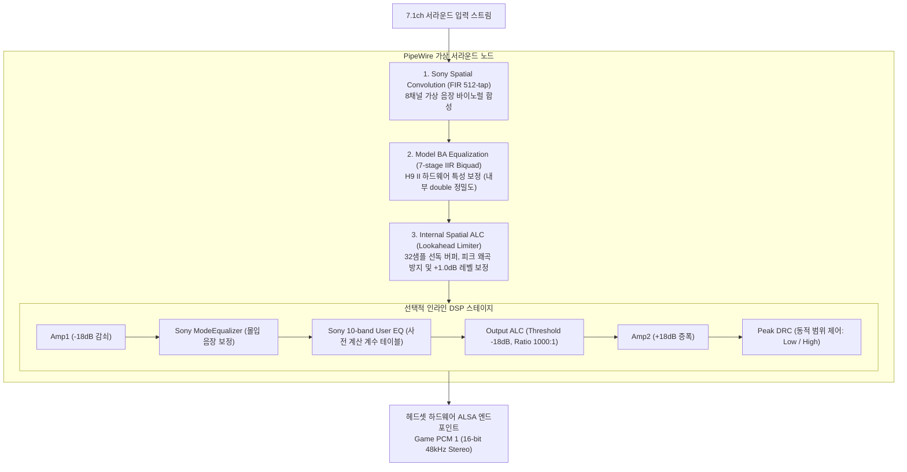
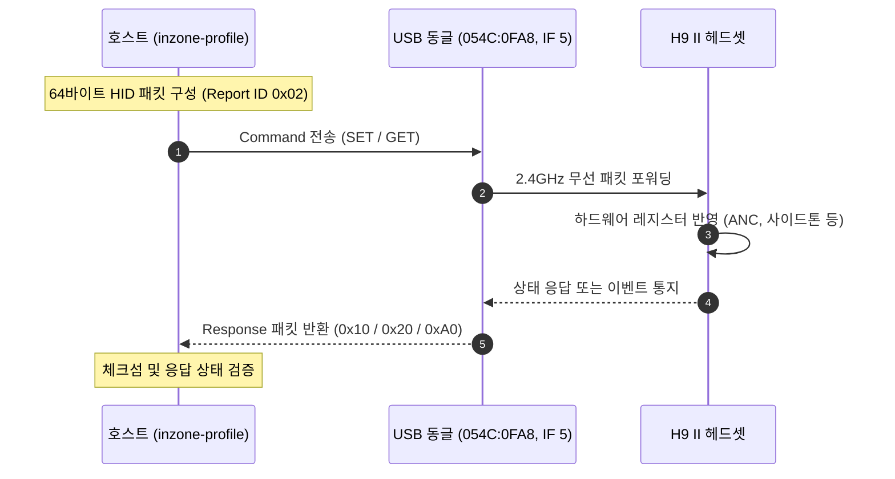

# Sony INZONE Hub 1.0.19.0 및 H9 II 리버스 엔지니어링 분석서

이 문서는 Sony 공식 유틸리티인 **INZONE Hub 1.0.19.0**과 무선 게이밍 헤드셋 **INZONE H9 II (MDR-G900N / 모델 코드 YY2987)**의 오디오 DSP 알고리즘 및 USB HID 제어 프로토콜을 분석하고, 이를 Linux(PipeWire / WirePlumber / Swift LADSPA) 환경에 재구현하기 위해 정리한 기술 분석서입니다.

---

## 1. 분석 대상 및 자산 무결성 (Provenance)

- **공식 지원 페이지**: [Sony MDR-G600/G900N Software Support](https://support.sony.jp/electronics/support/headphones-gaming-headphones/mdr-g600/software/00384248)
- **공식 설치 파일 URL**: `https://info.update.sony.net/HP002/APID001WN00/contents/0011/INZONEHub_Setup_1.0.19.0.exe`

### 1.1. 주요 바이너리 및 에셋 SHA-256 검증표

| 파일명 | 파일 크기 (Bytes) | SHA-256 체크섬 | 설명 |
|---|---|---|---|
| `INZONEHub_Setup_1.0.19.0.exe` | 144,916,520 | `8cb73e7524281905ec3e5f52679bb757557ee069571ec8c68ceff89d0edd2540` | 공식 InstallShield 설치 파일 |
| 내부 내장 MSI (`Data1.msi`) | 136,132,608 | `4c4ad6278dbbf29f231c091697c2a73e279ad211acadc4ee5edb5be85f22e35b` | 오프셋 `7,212,312`에 위치 |
| `inzonehub.dll` | 38,122,120 | `77082a578f25b2ef6722e256fd7f53de0d69678a8c852a7aaf4e8f569c542a5f` | .NET Core 관리형 UI 및 비즈니스 로직 |
| `inzonevirtualizer.dll` | 2,453,600 | `d3fb1a9619335af6f8256029714ac57ba53d643fb4ce9f43d8d50e3a20179860` | x86-64 네이티브 오디오 DSP 엔진 |
| `shp_for_game_v2.0_512tap.hki` | 57,952 | `1a5ab53581ddb5320c2475fcb85cd6243c0b7472bbe339f14dc03c90bd8cf62d` | 소니 기본 7.1 공간 음향 HRTF |
| `wh_g910n_standard.ba` | 192 | `9d9faae35a2db1ed16d277dbb73ea0e4e2bd96d85df5258593acf1dabf0797e2` | H9 II 하드웨어 보정용 7단 IIR 필터 |
| `downmix.hki` | 57,952 | `7f4bdc12b3885435a6305c9c138f3d66ee7da00874bdce7b5f0e12c21da9cdac` | 스테레오 다운믹스 필터 |
| `control.yaml` | 3,283 | `859c9cc66538ab11156783199c2dcd19687895e72e48e4693799389c9aab4621` | 몰입 음장 계수 정의 |

### 1.2. 인스톨러 페이로드 구조
InstallShield 설치 실행 파일은 오프셋 `7,212,312`에 MSI 데이터베이스를 포함하고 있으며, 그 안의 `Data1.cab` 압축을 해제하여 런타임 파일들을 추출할 수 있습니다.
- MSI File 테이블 분석 결과 `shp_for_game_v2.0_512tap.hki`는 런타임에 `standard_hrtf.hki`로 매핑됩니다.
- 관리형 어셈블리의 `ApoFileCommunication.SetVirtualizer`는 비개인화 서라운드가 켜졌을 때 `standard_hrtf.hki`와 모델 보정용 `wh_g910n_standard.ba`를 한 쌍으로 바인딩합니다.
- 서라운드가 꺼지면 `downmix.hki`가 선택되고 모델 BA 필터는 바이패스됩니다.

---

## 2. 네이티브 오디오 엔진 분석 (`inzonevirtualizer.dll`)

`inzonevirtualizer.dll`은 x86-64 네이티브 바이너리로, 기본 로드 주소(Image Base)는 `0x180000000`입니다.

### 2.1. 주요 함수 및 데이터 테이블 RVA 매핑

| 기능 및 서브루틴 | RVA | 분석 내용 |
|---|---|---|
| **HKI 키 유도 (Key Derivation)** | `0x9480` | 셀렉터 길이 테이블: `0x1f6ab0`, 포인터 테이블: `0x1f6ab8` |
| **BA 키 유도 (Key Derivation)** | `0x10c80` | 20-워드 상수 테이블: `0x1f7d80` |
| **AES-128-CBC 복호화 루틴** | `0x11520` | 표준 AES-CBC 복호화 및 PKCS#7 패딩 언패딩 |
| **MD5 무결성 검증** | `0x117f0` | 복호화된 평문의 MD5를 헤더 체크섬과 비교 |
| **공간 음향 컨볼루션 엔진 초기화** | `0x1840` / `0x2610` | 링버퍼 할당 및 FIR 필터 상태 초기화 |
| **공간 음향 실시간 샘플 렌더링** | `0x2c90` | 채널별 512-tap 컨볼루션 연산 |
| **내부 공간 ALC 초기화 / 처리** | `0xd5e0` / `0xd8b0` | 8-프레임 블록 단위 연산, 32샘플 선행 룩어헤드 |
| **외부 ALC (Output ALC)** | `0x11a90` / `0x11be0` | 10ms 피크 감쇠 기반 출력 자동 레벨 제어 |
| **Peak DRC (Dynamic Range Control)** | `0x18880` / `0x18af0` | 상향 압축 및 확장 구간을 갖는 동적 범위 제어 |
| **Model BA 바이쿼드 커널** | `0x11210` | 7단 직렬 IIR Biquad (내부 `double` 정밀도 상태 연산) |
| **사용자 10밴드 EQ 커널** | `0x155c0` | 10밴드 파라메트릭 Biquad EQ (`float32` 연산) |
| **Equalizer::SetParameters** | `0x19ae0` | 파라미터 재계산값보다 사전 계산 계수(`coefficients`) 우선 적용 |

### 2.2. 암호화 키 유도 알고리즘 (Key Derivation)
소니의 암호화 키는 바이너리에 평문으로 저장되지 않고, 헤더 정보와 내부 난독화 테이블을 조합하여 동적으로 생성됩니다:

1. **테이블 조회**: 파일 헤더의 `uint32` 마커를 읽어 DLL 데이터 섹션의 셀렉터 테이블 오프셋을 특정합니다.
2. **XOR 연산**: 테이블 길이로 나눈 나머지(`modulo`) 연산을 통해 테이블 엔트리와 마커를 XOR합니다.
3. **상태 순환 루프**: 16단계 바이트 순환 루프를 거쳐 16바이트(128비트) 대칭키 블록을 생성합니다.
4. **엔디안 변환**: AES 연산 직전 매 4바이트 그룹을 역순(Endian swap)으로 정렬합니다.
5. **초기화 벡터 (IV) 및 복호화**: 파일 헤더의 16바이트 체크섬 필드를 AES-128-CBC의 IV로 직접 사용합니다. 복호화 완료 후 PKCS#7 패딩을 제거하고 평문의 MD5 해시를 헤더의 체크섬과 비교하여 무결성을 검증합니다.

---

## 3. 독점 필터 파일 포맷 (HKI & BA)

### 3.1. HKI (Head-Related Impulse Response Container)
머리전달함수(HRTF) FIR 필터 계수를 담고 있는 바이너리 포맷입니다:

- **헤더 레이아웃 (144바이트)**:
  - `0x00`: 매직 넘버 `hki2`
  - `0x04`: 키 테이블 마커 (`uint32_le`)
  - `0x08`: 평문 MD5 체크섬 겸 AES IV (16바이트)
  - `0x38`: 샘플레이트 (`48000` Hz)
  - `0x3C`: 귀 수 (`2`: Left, Right)
  - `0x4C`: 암호화 모드 (`5`: 기본 에셋, `7`: 개인화 프로파일)
  - `0x50`: Cipher 7 의사난수 초기 시드 오프셋
  - `0x58`: 탭(Tap) 수 (`512`)
  - `0x5C`: 방향 수 (`14`)
  - `0x90`: AES-128-CBC 암호화된 페이로드 시작점
- **페이로드 구조**:
  - 총 평문 크기: 57,792 바이트 (14개 방향 × 2개 귀 × (16바이트 메타데이터 + 512탭 × 4바이트 float32)).
  - 각 레코드는 16바이트 헤더(`azimuth`, `polar`, `kind`, `ear`)와 뒤따르는 512개의 `float32` FIR 탭 계수로 이루어집니다.

### 3.2. BA (Biquad Array Correction Filter)
헤드셋 드라이버의 음향적 물리 특성을 보정하기 위한 다단 IIR 바이쿼드 필터입니다:

- **헤더 레이아웃 (48바이트)**:
  - `0x00`: 매직 넘버 `ba00`
  - `0x04`: 키 마커 (`uint32_le`)
  - `0x08`: 평문 MD5 해시 겸 AES IV (16바이트)
  - `0x18`: 샘플레이트 (`48000`)
  - `0x1C`: 바이쿼드 섹션 수 (`7`)
- **페이로드**: 복호화된 평문 크기는 정확히 140바이트 (7단 × 5개 계수 `b0, b1, b2, a1, a2`).
- **안정성 검증**:
  전달함수 $H(z) = \frac{b_0 + b_1 z^{-1} + b_2 z^{-2}}{1 + a_1 z^{-1} + a_2 z^{-2}}$의 모든 극점(Poles)이 단위 원(Unit circle) 내부에 존재함을 수학적으로 확인하여 무조건 안정(Unconditionally Stable) 상태임을 입증했습니다.

---

## 4. 오디오 채널 매핑 및 PipeWire 통합

### 4.1. 7.1ch 채널과 HKI 각도 매핑표

| PipeWire 채널 | HKI 방위각(Azimuth) | HKI 극각(Polar) | 음향적 위치 |
|---|---|---|---|
| **FL** (Front Left) | 330° | 90° | 전방 좌측 30° |
| **FR** (Front Right) | 30° | 90° | 전방 우측 30° |
| **FC** (Front Center) | 0° | 90° | 전방 중앙 |
| **LFE** (Low Frequency Effect) | 0° | 0° | 서브우퍼 (무지향성 저역) |
| **RL** (Rear Left) | 210° | 90° | 후방 좌측 150° |
| **RR** (Rear Right) | 150° | 90° | 후방 우측 150° |
| **SL** (Side Left) | 250° | 90° | 측면 좌측 110° |
| **SR** (Side Right) | 110° | 90° | 측면 우측 110° |

### 4.2. Game/Chat 하드웨어 듀얼 스트림 격리
INZONE H9 II 동글은 단일 USB 디바이스 내에 2개의 재생 PCM을 제공합니다:
- **PCM 0 (Interface 1)**: Chat 스트림 (통화용)
- **PCM 1 (Interface 4)**: Game 스트림 (게임 및 메인 출력용)

리눅스 기본 드라이버는 간혹 PCM 0을 메인 오디오로 잘못 잡는 문제가 있으므로, 본 프로젝트는 WirePlumber 매핑 설정(`52-inzone-game-chat.conf`)을 통해 공간 음향 효과가 항상 Game 스트림(PCM 1)에 안정적으로 바인딩되도록 강제 격리합니다.

---

## 5. DSP 신호 처리 파이프라인 구조

실시간 처리는 PipeWire filter-chain과 Embedded Swift로 빌드된 고성능 LADSPA 플러그인(`native/inzone_dsp.so`)을 통해 이뤄집니다:



### 5.1. 수치 정밀도(ULP) 보존
소니 원본 엔진은 $-18\text{dB}$ 감쇠와 $+18\text{dB}$ 복구 시 단정밀도 상수 `powf(10.0f, ±18.0f / 20.0f)`를 사용합니다:
- `Amp1`: `0.1258925497531891`
- `Amp2`: `7.943282127380371`
이를 `double`로 계산 후 `float`로 캐스팅하면 최하위 비트(1 ULP) 오차가 생기므로, 소니 원본의 수치 상수를 비트 단위로 완벽하게 보존하여 구현했습니다.

---

## 6. Linux PipeWire 연동 시 발견된 이슈 및 해결

### 6.1. PipeWire 1.6.8 filter-graph 내림차순 버그 해결
PipeWire 1.6.8의 `audioconvert` 모듈 소스코드를 분석한 결과, 필터 그래프를 인덱스 번호 기준 내림차순(역순)으로 실행하는 특성이 있었습니다. 이로 인해 정방향으로 등록하면 DRC와 EQ의 처리 순서가 뒤집히는 문제가 발생했습니다.
- **해결**: WirePlumber 설정 생성기(`GraphRenderer.swift`)에서 의도한 DSP 순서의 역순으로 그래프 인덱스를 배치하여, 실제 실행 시 정방향(`Amp1` → `ModeEQ` → `EQ` → `ALC` → `Amp2` → `DRC`)으로 처리되도록 보정했습니다.

### 6.2. 4096바이트 파싱 버퍼 한계 우회
PipeWire의 `parse_prop_params()` 함수는 인라인 노드 속성 문자열 파싱 시 4096바이트 크기의 버퍼를 사용합니다. 10단 Biquad 계수와 DRC, ALC 설정이 하나의 JSON 문자열로 전달되면 버퍼가 초과되어 로드가 실패했습니다.
- **해결**: 신호 그래프를 단위 기능별 독립 서브그래프로 분할하여 각 청크가 4096바이트를 넘지 않도록 안전하게 분할 배치했습니다.

---

## 7. USB HID 하드웨어 제어 프로토콜

H9 II 헤드셋의 하드웨어 설정(ANC, 사이드톤, 음량 밸런스 등)은 USB 인터페이스 5를 통해 Vendor-Specific HID 리포트로 제어됩니다:

- **장치 정보**: `054C:0FA8`, Interface 5, Usage Page `0xFF04`
- **리포트 구조**: 고정 64바이트 길이, Report ID `0x02`

```
[0x02] [Len] [0x01] [0x00, 0xFC] [ParamLen] [0x96, 0xC3] [Address] [EventID] [Type] [TxID] [Payload...] [Checksum] [0x00...]
```

- `Sony Key`: 고정 `0xC396` (리틀엔디안: `0x96, 0xC3`)
- `Address`: 송수신 주소 `(Target << 4) | Source` (헤드셋: `0x41`, 동글: `0x21`)
- `Checksum`: `Sony Key`부터 `Payload` 끝까지의 바이트 합 modulo 256



### 7.1. 주요 하드웨어 제어 Event ID

| 기능명 | Event ID | 인덱스 | 유효 값 | 설명 |
|---|---|---|---|---|
| `anc` | 65 | 0 | 0, 1, 2 | 0: 끔, 1: 노이즈 캔슬링(NC), 2: 주변 소리 |
| `ambient_level` | 65 | 1 | 1 ~ 20 | 주변 소리 크기 조절 (20단계) |
| `voice_focus` | 65 | 3 | 0, 1 | 0: 음성 집중 끔, 1: 음성 집중 켬 |
| `game_chat` | 34 | 0 | 0 ~ 100 | Game/Chat 음량 밸런스 (50: 중앙) |
| `sidetone` | 35 | 0 | 0 ~ 10 | 내 목소리 듣기 볼륨 (0~10) |
| `toggle_*` | 66 | 0~2 | 0, 1 | 본체 NC 버튼 누를 때 순환할 모드 지정 |
| `nc_startup` | 67 | 0 | 0 ~ 3 | 전원 켤 때 NC 초기값 (0:끔, 1:NC, 2:주변소리, 3:이전상태) |
| `auto_power` | 129 | 0 | 0, 5, 15, 30, 60, 180 | 자동 절전 타이머 (분 단위, 0: 꺼짐) |
| `battery` | 4 | - | 0 ~ 100 | 배터리 잔량 및 충전 상태 (조회 전용) |
| `firmware` | 3 | - | 문자열 | 헤드셋/동글 펌웨어 버전 (조회 전용) |

---

## 8. 개인화(Personalization) Cipher 7 스트림 암호 역공학

모바일 앱에서 귀 사진을 기반으로 생성된 개인화 프로파일(`personalized_hrtf.hki`)은 일반 암호화(Cipher 5)와 달리 **Cipher 7** 스트림 암호화가 2차 적용되어 있습니다:

1. **1차 AES-128-CBC 복호화**: 기존 HKI와 동일한 키 유도 과정을 거칩니다.
2. **2차 워드 XOR 마스킹**:
   - **초기 시드**: HKI 헤더 오프셋 `80`의 `uint32` 값 + `0x52276af7`
   - **의사난수 생성기 점화식 (PRNG)**:
     $$\text{seed}_{n+1} = (\text{seed}_n \times 0x80849 + 0x2a3b5) \pmod{2^{32}}$$
   - **워드 마스크**: `mask = seed + (seed >> 24)`
3. 복호화된 데이터의 전체 바이트 합 modulo 256을 헤더 체크섬과 대조하여 최종 무결성을 확인합니다.
4. 14개 방향 및 양쪽 귀에 대해 1024-포인트 복소 FFT를 수행하고 최대 크기가 18.0을 넘지 않도록 정규화하여 안전하게 파이프라인에 로드합니다.
